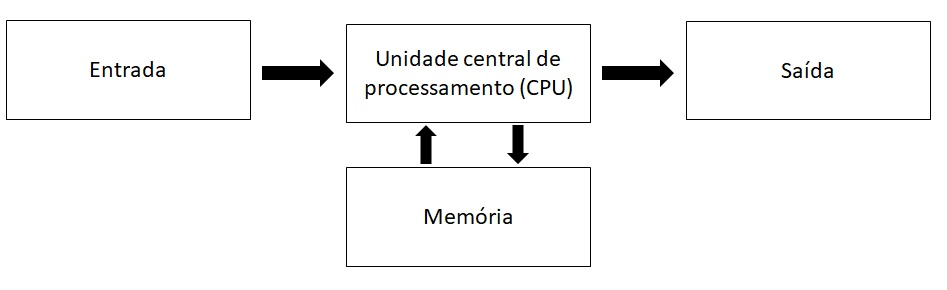
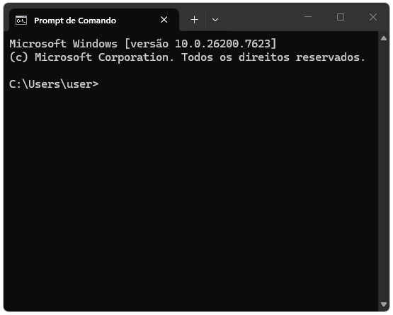
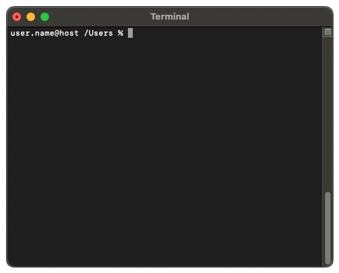
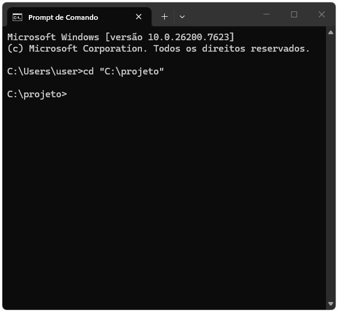
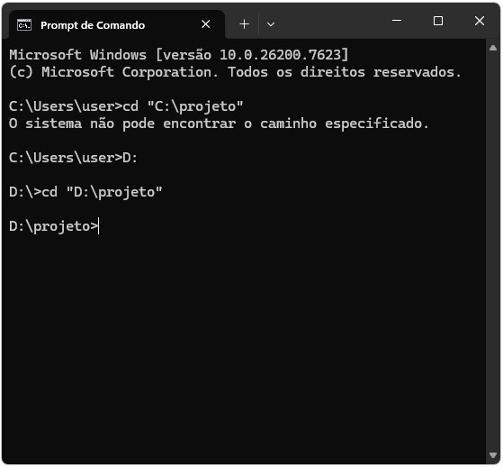

# Fundamentos de computação {#sec-fundamentos}

## Introdução

Antes de escrever qualquer linha de código, é importante entender o ambiente no qual a programação acontece. Programar não é apenas aprender uma linguagem específica, mas também compreender como o computador organiza arquivos, executa comandos e interage com o sistema operacional. Muitos dos erros e dificuldades enfrentados por iniciantes em programação não estão relacionados à lógica do código em si, mas ao uso do computador como ferramenta de trabalho: navegar por diretórios, localizar arquivos, executar programas e interpretar mensagens do sistema. Esses aspectos são frequentemente tratados como triviais, mas são fundamentais para o uso eficiente de qualquer linguagem de programação.

Este capítulo introduz conceitos fundamentais sobre o funcionamento de computadores, a representação de informações em bits e bytes, a organização de arquivos e a forma como interagimos com o sistema operacional via terminal. Esses elementos servirão como infraestrutura conceitual para todo o restante do curso. O foco aqui não é aprofundar detalhes técnicos de hardware ou sistemas operacionais, mas fornecer uma visão prática e funcional do ambiente computacional que será utilizado ao longo da disciplina. 

{#fig-olddesk width=700px max-width=100% fig-align="center"}

### Pré-requisitos

Neste capítulo introdutório não utilizaremos nenhum programa ou linguagem. Ele foi escrito para que mesmo o aluno sem nenhum tipo de conhecimento em computação e com o mínimo de conhecimento a respeito de operações matemática elementares tenha capacidade de acompanhar. Basta curiosidade!

## Como um computador funciona

Um computador realiza duas coisas e apenas duas coisas: faz operações e guarda de forma eficiente o resultado dessas operações. No entanto, ao fazer essas duas coisas de forma extremamente eficiente essa máquina chamada computador nos permite receber, armazenar, processar e transmitir informações. Em essência, o computador nos serve ao propósito de **resolução de problemas**. Isso significa que, através de uma linguagem formal (especificamente operações de computação), podemos formular problemas e programar meios de resolver de forma automatizada tais problemas. No fim das contas, programar é o ato de criar programas, isto é, estabelecer uma sequência de instruções em linguagem formal que especifica como executar uma determinada operação no computador. 

Mas antes de avançar na ideia de programa e algoritmos, quais são as características de um computador como o conhecemos?

### Sistema computacional

Um sistema computacional é resultado da integração de componentes atuando como uma entidade, com o propósito de processar dados, isto é, realizar algum tipo de operação lógica envolvendo os dados, de modo a produzir diferentes níveis de informações. Tais sistemas são compostos por 3 principais elementos: hardware, software e o componente humano. O hardware inclui os componentes físicos enquanto o software é o conjunto de instruções que diz ao hardware o que fazer. No entanto, o software não elabora e decide sozinho o tipo de instrução a ser enviada ao hardware, é só através do componente humano que as instruções e objetivos são definidos. 

* **Hardware**: componente físico de um sistema de computação, isto é, todos os equipamentos utilizados pelo usuário nas ações de entrada, processamento, armazenamento e saída de dados. Exemplos:
   - Teclado, mouse, impressora
   - Unidade central de processamento (CPU, em inglês) ou processador
   - Placa mãe
   - Placa de vídeo (GPU)
   - Memória RAM
   - Disco rígido de armazenamento

<br>

* **Software**: componente lógico de um sistema de computação, isto é, séries de instruções que fazem o computador funcionar. São os famosos programas de computador, que podem ser (i) proprietários e utilizáveis a partir da compra de uma licença ou (ii) gratuitos. Exemplos:
   - Editores de texto (e.g., Microsoft Word)
   - Editor de planilhas (e.g., Microsoft Excel)
   - Browsers para navegação na internet (e.g., Safari e Google Chrome)

<br>

* **Componente humano**: as pessoas, que utilizam o computador basicamente como ferramenta para atingir determinado fim, para resolver problemas. Sem a ação de um indivíduo o sistema computacional não funciona, já que (ainda) depende das instruções e direcionamento humano para definir o que o software deve fazer e como deve interagir com o hardware.

### Arquitetura de um computador

A arquitetura de um computador define como os componentes estão interconectados e como eles colaboram para executar tarefas. Os computadores, como os conhecemos hoje, são estruturados em cima da lógica proposta inicialmente por John Von Neumann, matemático húngaro que viveu durante a primeira metade do século XX e que contribuiu imensamente em várias áreas das ciências. Embora tenhamos hoje uma complexidade maior nos elementos que compõe a arquitetura de um computador, a estrutura básica por trás dos computadores mais modernos continua sendo aquela proposta por Von Neumann. Essa arquitetura pode ser representado pelo diagrama abaixo:

{#fig-arquitetura width=700px max-width=100% fig-align="center"}

Essencialmente, o hadware que compõe as partes da arquitetura de um computador podem ser dividas em 3 partes:

* **Dispositivos de entrada e saída**: é através deles que o usuário dialoga com a máquina. Através do teclado e mouse, por exemplo, o usuário fornece informações ao computador a partir das quais processos serão realizados e seus resultados serão percebidos pelos dispositivos de saída (monitor e impressora, por exemplo).

* **Processador ou CPU**: é o cérebro do sistema computacional, é nele que serão executados cálculos e instruções lógicas dos usuários. 

* **Memória**: aqui são armazenados temporariamente os resultados dos cálculos, dados e instruções. Esse armazenamento na memória, porém, não é feito de forma permanente, ele serve apenas como suporte ao processador. É como se o processador utilizasse a memória de caderno de anotações, retomando o resultado dos cálculos já realizados sempre que necessário. 

::: {.callout-important title="Importante"}
Não confunda _memória_ com o que chamamos de _armazenamento_. A memória do computador, normalmente na forma da chamada memória RAM (sigla para _Random Access Memory_), é responsável por armazenar temporariamente os dados de dos programas que estão em uso, permitindo acesso rápido pelo processador. É também chamada de memória volátil: todo o seu conteúdo é perdido quando o computador é desligado.

Já as informações armazenadas no disco rígido (_Hard Disk Drive_, HDD) ou na unidade de estado sólido (_Solid-State Drive_, SSD) não são perdidas quando o computador é desligado. Esses dispositivos mantêm os dados armazenados de forma persistente, funcionando como a "memória de longo prazo" do computador. Por isso, esse tipo de armazenamento é chamado de memória não volátil.

Fazendo uma analogia com o funcionamento do nosso cérebro, a memória RAM armazena informações de curto prazo, como o que você almoçou hoje. Esse tipo de informação é importante ao longo do dia, por exemplo para saber se você já se alimentou bem ou se ainda está longe da sua meta diária de proteína, mas costuma ser esquecida depois que você dorme.

Já o HDD ou SSD armazena informações de longo prazo, como memórias da infância ou experiências passadas. Essas informações não são utilizadas constantemente no dia a dia, mas permanecem disponíveis e podem ser úteis em conversas com amigos ou como aprendizado acumulado, por exemplo na hora de decidir como cuidar dos seus filhos quando chegar a hora.
:::

### Bits e bytes

Para entender como um computador armazena e processa informações, é necessário compreender o conceito de sistema binário ou sistema de base 2^[Para entender um pouco mais sobre a história do sistema binário acesse o [link](https://imasters.com.br/tecnologia/a-historia-do-codigo-binario-a-base-da-computacao-moderna).]. Diferentemente do sistema decimal, que utilizamos no dia a dia e possui dez dígitos (de 0 a 9), os computadores operam utilizando apenas dois estados possíveis: 0 e 1. Pense nisso como um interruptor, em que 1 representa o estado "ligado" e 0 o estado "desligado". Os processadores atuais de um computador são resultado da junção de bilhões desses minúsculos "interruptores", também chamados de transistores.

Esses dois estados, 0 ou 1, também são chamados de bits (do inglês _binary digits_). Um bit representa a menor unidade de informação que um computador pode armazenar. Qualquer informação processada por um computador -- números, textos, imagens ou vídeos -- é, em última instância, representada como uma sequência de bits. 

Como trabalhar com bits individualmente seria pouco prático, eles são agrupados em unidades maiores chamadas de bytes. Um byte é composto por 8 bits e permite representar um conjunto maior de valores. Um byte pode representar 256 ($2^8 = 256$) combinações diferentes, o que é suficiente para representar todas as letras maiúsculas e minúsculas, números e símbolos básicos do alfabeto inglês. Não à toa, o byte se tornou a unidade padrão de medida quando o assunto é capacidade de armazenar informação em um computador. A Tabela @tbl-binario mostra como converter alguns números do sistema decimal para o sistema binário de 8 bits, em que cada dígito dibário indica a presença ou ausência de uma potência de 2.

| Número decimal | Número binário | Cálculo para conversão                                                                                        |
|:--------------:|:--------------:|:-------------------------------------------------------------------------------------------------------------:|
| 0              | 00000000       | $0\cdot 2^7 + 0\cdot 2^6 + 0\cdot 2^5 + 0\cdot 2^4 + 0\cdot 2^3 + 0\cdot 2^2 + 0\cdot 2^1 + 0\cdot 2^0 = 0$   |
| 1              | 00000001       | $0\cdot 2^7 + 0\cdot 2^6 + 0\cdot 2^5 + 0\cdot 2^4 + 0\cdot 2^3 + 0\cdot 2^2 + 0\cdot 2^1 + 1\cdot 2^0 = 1$   |
| 5              | 00000101       | $0\cdot 2^7 + 0\cdot 2^6 + 0\cdot 2^5 + 0\cdot 2^4 + 0\cdot 2^3 + 1\cdot 2^2 + 0\cdot 2^1 + 1\cdot 2^0 = 5$   |
| 48             | 00110000       | $0\cdot 2^7 + 0\cdot 2^6 + 1\cdot 2^5 + 1\cdot 2^4 + 0\cdot 2^3 + 0\cdot 2^2 + 0\cdot 2^1 + 0\cdot 2^0 = 48$  |
| 137            | 10001001       | $1\cdot 2^7 + 0\cdot 2^6 + 0\cdot 2^5 + 0\cdot 2^4 + 1\cdot 2^3 + 0\cdot 2^2 + 0\cdot 2^1 + 1\cdot 2^0 = 137$ |
| 255            | 11111111       | $1\cdot 2^7 + 1\cdot 2^6 + 1\cdot 2^5 + 1\cdot 2^4 + 1\cdot 2^3 + 1\cdot 2^2 + 1\cdot 2^1 + 1\cdot 2^0 = 255$ |

: Representação de números decimais no sistema binário e detalhamento do cálculo para conversão. {#tbl-binario tbl-colwidths="[20,20,60]" .hover}

A partir dos bytes, surgem unidades maiores, amplamente utilizadas para medir o tamanho de arquivos, a quantidade de memória e a capacidade de armazenamento: quilobytes, megabytes, gigabytes, terabytes e petabytes. Essas unidades indicam, essencialmente, quantos bytes são necessários para representar uma determinada quantidade de informação.

- Kilobyte (KB): $1{,}024$ (ou $2^{10}$) bytes.
- Megabyte (MB): $1{,}048{,}576$ (ou $2^{20}$) bytes.
- Gigabyte (GB): $1{,}073{,}741{,}824$ (ou $2^{30}$) bytes.
- Terabyte (TB): $1{,}099{,}511{,}627{,}776$ (ou $2^{40}$) bytes.
- Petabyte (PB): $1{,}125{,}899{,}906{,}842{,}624$ (ou $2^{50}$) bytes.
- Exabyte, Zettabyte, Yottabyte...

Compreender bits e bytes é fundamental para entender por que arquivos têm tamanhos diferentes, por que algumas operações exigem mais memória do que outras e por que certas tarefas computacionais são mais custosas do ponto de vista de processamento. Esses agrupamentos de bits (bytes) são as unidades básicas que a memória e o armazenamento usam para guardar informação. A próxima seção explica o papel desses componentes e como eles impactam o desempenho prático.

  
### Processamento, memória e armazenamento na prática

Podemos entender o funcionamento de um computador como um fluxo contínuo de **leitura**, **processamento** e **armazenamento** de bits. Quando observamos as especificações de um computador pessoal, é comum encontrar informações como número de núcleos do processador (_cores_), frequência do processador em gigahertz (GHz), quantidade de memória RAM e capacidade de armazenamento em disco. Esses números descrevem, essencialmente, a velocidade e a escala com que o computador consegue manipular grandes volumes de informação binária em cada etapa desse fluxo contínuo.

**Processamento** refere-se à execução de instruções sobre dados representados em bits. O processador é o componente responsável por realizar operações elementares que, em última instância, são operações lógicas sobre sequências de zeros e uns. A frequência do processador indica aproximadamente quantos ciclos de processamento podem ser realizados por segundo. Frequências mais altas permitem que mais instruções sejam executadas em menos tempo, embora o desempenho final dependa também da organização do código, do tipo de tarefa e do acesso à memória. Além disso, processadores modernos possuem múltiplos _cores_ ou núcleos. O uso de múltiplos núcleos permite paralelismo, isto é, a execução simultânea de diferentes partes de uma tarefa, de forma análoga a dividir um trabalho entre várias pessoas para concluí-lo mais rapidamente.

**Memória (RAM)** é o espaço onde os dados e instruções ficam armazenados temporariamente enquanto estão sendo processados. É na memória RAM que o computador mantém os bytes que serão acessados repetidamente pelo processador. Quanto maior a quantidade de RAM disponível, maior é o volume de dados que pode ser mantido "em uso" ao mesmo tempo. Quando a RAM é insuficiente, o computador passa a usar o disco como apoio, o que reduz drasticamente o desempenho.

**Armazenamento**, por sua vez, diz respeito ao local onde os dados são guardados de forma permanente. HDDs e SSDs armazenam grandes volumes de bytes mesmo quando o computador está desligado. A diferença principal é que SSDs permitem acesso muito mais rápido aos dados, reduzindo o tempo necessário para carregar programas, abrir arquivos e transferir grandes conjuntos de dados para a memória.

Vistos em conjunto, processamento, memória e armazenamento formam um sistema integrado: dados são lidos do disco, carregados na memória, processados pela CPU e, quando necessário, gravados novamente no armazenamento. Para tarefas simples, esse fluxo passa despercebido. Para programação, análise de dados e computação numérica compreender essas etapas ajuda a interpretar erros, gargalos de desempenho e limitações práticas do ambiente computacional.

::: {.callout-tip title="O que significam as especificações do seu computador?"}

Considere um computador com processador com 16 núcleos e frequência de 3.2 GHz, 32 GB de memória RAM e 1 TB de SSD. Esses números descrevem como ele lida com bits e bytes em diferentes etapas do processamento.

- **16 núcleos (cores)** indicam que o processador pode executar várias tarefas ao mesmo tempo. Em aplicações que permitem paralelismo -- como certas operações numéricas ou análises sobre grandes conjuntos de dados -- isso é semelhante a dividir o trabalho entre dezesseis pessoas em vez de apenas uma.

- **3.2 GHz** refere-se à velocidade com que cada núcleo executa instruções elementares. Em termos simples, indica quantos passos o processador consegue dar por segundo ao manipular dados representados em sistema binário.

- **32 GB de RAM** significam que até esse volume de dados pode permanecer disponível para acesso rápido enquanto programas estão em execução. Bases de dados grandes, matrizes extensas e múltiplos processos consomem memória rapidamente.

- **1 TB de SSD** indica a capacidade de armazenamento permanente.

Em análise de dados e programação, problemas de desempenho raramente estão ligados apenas à velocidade do processador. Com frequência, eles surgem porque os dados são grandes demais para caber na memória ou porque operações são realizadas de forma pouco eficiente. Entender essas especificações ajuda a interpretar erros, lentidão e limitações práticas do ambiente computacional.
:::

## Arquivos e diretórios

Mais do que armazenar informação, é importante entender _onde_ e _como_ a informação é armazenada. Assim como na vida cotidiana, é preciso ter organização no armazenamento para saber como e onde procurar determinada informação no computador. Se você é uma pessoa organizada, você sabe que o iogurte estará sempre guardada na geladeira e em algum pote fechado, não é preciso procurar debaixo do chuveiro em um saco de pão.

### Estrutura hierárquica

Os diretórios servem justamente para organizar o armazenamento do computador. É como se você pudesse separar o seu SSD primeiro em cômodos, depois em armários dentro de cada cômodo, em gavetas dentro de cada armário e assim por diante. Formalmente, um diretório pode ser entendido como um contêiner no qual arquivos e outros diretórios podem estar organizados, formando uma estrutura hierárquica. Essa organização permite localizar, acessar e manipular arquivos de forma sistemática, especialmente em projetos maiores.

Por exemplo, a organização de um projeto de análise de dados pode ter a seguinte forma:

```text
C:\
└── projeto\
    ├── data\
    │   └── dados.csv
    ├── scripts\
    │   └── analise.py
    └── resultados\
        └── figura1.png
```

Nesse exemplo, `projeto` é um diretório que está dentro da partição C e que contém outros diretórios. O arquivo `dados.csv`, por exemplo, está dentro do diretório `data`, que é um diretório localizado dentro do diretório `projeto`. Para acessar esse arquivo `dados.csv` dentro dessa estrutura hierárquica de diretórios utilizamos duas formas principais: o caminho absoluto ou o caminho relativo.

- **Caminho absoluto**: descreve a localização completa a partir da raiz do sistema de arquivos. Nesse caso, o caminho absoluto seria `C:\projeto\data\dados.csv`.
- **Caminho relativo**: descreve a localização em relação ao diretório atual. Isso quer dizer que, se estivermos trabalhando em um programa a partir do diretório `projeto`, para acessar o arquivo de dados basta descrever o caminho relativo a partir dali: `data/dados.csv`.

### Extensões de arquivos

Para além do _onde_, a informação em si pode ser armazenada de várias formas. Você pode guardar o iogurte em uma jarra de vidro ou mantê-lo no recipiente original. Um conjunto de informação é armazenada em um arquivo que pode ter vários formatos ou **extensões**. A extensão do arquivo corresponde ao sufixo após o ponto no nome do arquivo e indica como os dados estão organizados internamente e quais programas sabem interpretá-los corretamente. Do ponto de vista conceitual, a extensão não "muda" o dado em si, mas define a estrutura lógica usada para representar a informação. O mesmo conjunto de informações pode ser salvo em formatos diferentes, dependendo do objetivo (leitura humana, processamento automático, troca entre sistemas etc.).

Um formato muito comum em análise de dados é o CSV (`.csv`, _Comma-Separated Values_). Trata-se de um arquivo de texto em que os dados são organizados em linhas e colunas, sendo as colunas separadas por um delimitador, geralmente uma vírgula. Cada linha representa uma observação e a primeira linha costuma conter os nomes das variáveis. Arquivos CSV são amplamente utilizados porque (i) são simples e legíveis; (ii) podem ser abertos em editores de texto, planilhas e softwares estatísticos; e (iii) são facilmente importados por linguagens como Python.

Outro formato bastante utilizado é o JSON (`.json`, _JavaScript Object Notation_). Embora também seja um arquivo de texto, sua estrutura é diferente. Em vez de linhas e colunas, os dados são organizados como pares chave–valor, de forma semelhante a um dicionário, podendo conter listas e estruturas aninhadas. Esse formato é muito usado para troca de dados entre sistemas e aplicações, além do uso para armazenamento de configurações.

Outras extensões comuns incluem:

- `.txt`: texto simples, sem estrutura fixa.
- `.xlsx`: arquivos de planilha do Microsoft Excel.
- `.py`: arquivos de código Python.

É importante enfatizar que a extensão não garante o conteúdo do arquivo: um `.csv` mal formatado pode não ser lido corretamente, e um arquivo `.txt` pode conter dados altamente estruturados. Ainda assim, seguir convenções de extensão é essencial para organização de projetos, reprodutibilidade e interoperabilidade entre ferramentas. Considere a tabela de notas abaixo:

| nome   | nusp     | ingresso | materia | media |
|:------:|:--------:|:--------:|:-------:|:-----:|
| Joao   | 12345678 | 2026     | EAE1106 | 8     |
| Miguel | 5253678  | 2023     | EAE1106 | 4     |
| Alice  | 9743678  | 2025     | EAE1106 | 9     |

O armazenamento desses dados em formato CSV e JSON é feito da seguinte maneira:

- Formato CSV

   ```text
   nome,nusp,ingresso,materia,media
   Joao,12345678,2026,EAE1106,8
   Miguel,52543678,2023,EAE1106,4
   Alice,9743678,2025,EAE1106,9
   ```
- Formato JSON

   ```text
   [
   {
      "nome": "Joao",
      "nusp": 12345678,
      "ingresso": 2026,
      "materia": "EAE1106",
      "media": 8
   },
   {
      "nome": "Miguel",
      "nusp": 52543678,
      "ingresso": 2023,
      "materia": "EAE1106",
      "media": 4
   },
   {
      "nome": "Alice",
      "nusp": 9743678,
      "ingresso": 2025,
      "materia": "EAE1106",
      "media": "9"
   }
   ]
   ```

Mas qual a importância disso tudo? Entender como os computadores armazenam números e como arquivos e diretórios são organizados e acessados pelo sistema operacional ajuda a compreender limitações e comportamentos observados na prática. Por exemplo, explica por que um sistema de 32 bits é capaz de alocar apenas até 4 GB de memória RAM ou por que arquivos com milhões de linhas podem ser difíceis de abrir ou processar em um computador local.

Ter um conhecimento mínimo sobre o funcionamento do computador e sobre como os programas interagem com sua arquitetura permite entender o que ocorre "por trás das cortinas". Com isso, podemos usar o computador como uma ferramenta para resolver problemas — e não como um fim em si. Para chegar a esse ponto, precisamos de meios formais para nos comunicar com o sistema operacional e, posteriormente, expressar instruções de forma lógica e precisa.

## Terminal

Um passo intermediário entre o funcionamento interno do computador e as linguagens de programação é o terminal. O terminal é uma interface textual que permite interagir diretamente com o sistema operacional por meio de comandos simples. Em vez de clicar em ícones ou navegar por menus gráficos, o usuário descreve explicitamente o que deseja que o computador faça.

O uso do terminal torna visíveis conceitos introduzidos na seção anterior, como arquivos e diretórios, além de fornecer um primeiro contato com a lógica de comandos que será essencial ao longo do curso. A Figura @fig-terminal ilustra o ambiente típico do terminal nos dois principais sistemas operacionais em uso atualmente.

::: {#fig-terminal layout-ncol=2 width=700px max-width=100% fig-align="center"}





Interface usual do terminal
:::

Comandos básicos no terminal (ou prompt de comando) do Windows incluem:

- `dir`: lista arquivos e diretórios no ambiente atual
- `cd`: muda de diretório
- `mkdir`: cria um novo diretório

No exemplo do painel A da Figura @fig-terminal, `cd "C:\projeto"` muda o ambiente atual do diretório `C:\Users\user` para `C:\projeto`. Note, porém, que se a pasta `projeto` estiver em outra partição do seu armazenamento, é preciso primeiro mudar para essa partição para depois utilizar o comando `cd`. A Figura @fig-cmd ilustra esses dois casos.

::: {#fig-cmd layout-ncol=2 width=700px max-width=100% fig-align="center"}





Exemplo de uso do terminal para mudar o ambiente atual
:::

Mesmo que você utilize interfaces gráficas, compreender o terminal facilita o entendimento de como o computador está organizado e de como o sistema operacional executa tarefas básicas. Ao longo do curso, o terminal será utilizado principalmente para executar programas, navegar entre diretórios e instalar novos pacotes e ferramentas.

Apesar de útil, o terminal ainda exige que as instruções sejam dadas comando a comando, de forma relativamente limitada e pouco reutilizável. Se queremos resolver problemas mais gerais e automatizar tarefas de forma sistemática, é necessário um nível adicional de abstração.

## Linguagens de programação 

Para atingir esse nível adicional de abstração, precisamos de um meio de comunicar instruções ao computador de maneira precisa e sem ambiguidades. Esse meio são as linguagens de programação, que definem regras formais para descrever operações, decisões e cálculos que o computador pode executar. Diferentemente das linguagens naturais, como o português que eu e você falamos, as linguagens de programação são linguagens formais, que foram criadas pelas pessoas para aplicações específicas. A notação usada pelos matemáticos é uma linguagem formal adequada para representar relações entre números e símbolos; químicos utilizam linguagens formais para representar a estrutura de moléculas. Utilizamos as linguagens de programação para nos comunicar de forma inequívoca com os computadores.

### Sintaxe e semântica

Toda linguagem de programação possui dois níveis fundamentais: sintaxe e semântica.

A **sintaxe** refere-se às regras de escrita da linguagem. Ela define quais símbolos e quais sequências de símbolos são válidas: onde usar parênteses, palavras-chave, operadores e a ordem correta dos elementos. Erros de sintaxe são, em geral, fáceis de identificar porque a execução do programa é interrompida e uma mensagem de erro é apresentada. Exemplos comuns incluem esquecer um caractere obrigatório em determinada sequência, utilizar parênteses, colchetes ou aspas sem o fechamento correspondente ou escrever palavras-chave de forma incorreta. Nesses casos, o computador não consegue sequer interpretar a estrutura do código, independentemente da intenção do programador.

Por outro lado, a **semântica** refere-se ao significado das instruções. Um código pode estar sintaticamente correto, mas produzir resultados errados por não representar corretamente a intenção do programador. Erros semânticos são mais sutis, pois o código respeita todas as regras formais da linguagem e é executado normalmente, mas o resultado obtido está incorreto. Por exemplo, um programa pode calcular uma média dividindo a soma dos valores pelo número errado de observações ou usar uma variável diferente da pretendida em uma expressão. Esses erros não geram mensagens automáticas do computador e só podem ser detectados pela análise crítica dos resultados produzidos.

Essa distinção é central em programação. O computador consegue verificar automaticamente erros de sintaxe, mas não é capaz de julgar se o significado do programa está correto do ponto de vista do problema que se deseja resolver.

### Diferenças entre linguagens naturais e formais

Embora as linguagens formais e naturais tenham muitas características em comum -- símbolos, estrutura, sintaxe e semântica -- há algumas diferenças:

1. **Ambiguidade**: as linguagens naturais são cheias de ambiguidade e as pessoas lidam com isso usando pistas contextuais e outras informações. As linguagens formais são criadas para ser quase ou completamente inequívocas, ou seja, qualquer afirmação tem exatamente um significado, independentemente do contexto

2. **Redundância**: para compensar a ambiguidade e reduzir equívocos, as linguagens naturais usam muita redundância. Por causa disso, muitas vezes são verborrágicas. As linguagens formais são menos redundantes e mais concisas.

3. **Literalidade**: as linguagens naturais são cheias de expressões e metáforas. Se eu digo "caiu a ficha", provavelmente não há ficha nenhuma na história, nem nada que tenha caído (esta é uma expressão para dizer que alguém entendeu algo depois de certo período de confusão). As linguagens formais têm significados exatamente iguais ao que expressam.

Como todos nós crescemos falando linguagens naturais, às vezes é difícil se ajustar a linguagens formais. As linguagens formais são mais densas que as naturais, então exigem mais tempo para a leitura. Além disso, a estrutura é importante, então nem sempre é melhor ler de cima para baixo e da esquerda para a direita. Em vez disso, aprenda a analisar o programa primeiro, identificando os símbolos e interpretando a estrutura. E os detalhes fazem diferença. Pequenos erros em ortografia e pontuação, que podem não importar tanto nas linguagens naturais, podem fazer uma grande diferença em uma língua formal.

### Alto nível X baixo nível

As linguagens de programação também diferem quanto ao seu nível de abstração. Na ciência da computação, **linguagens de programação de alto nível** abstraem detalhes do funcionamento interno do computador, permitindo que o programador se concentre na lógica do problema. São linguagens mais próximas das linguagens humanas e mais distantes das linguagens de máquina (e do sistema binário). Tais linguagens podem usar elementos de linguagem natural, serem mais fáceis de usar, ou podem ocultar totalmente áreas significativas de sistemas de computação, como o gerenciamento de memória. Isso torna o processo de desenvolvimento de um programa mais simples e eficiente. Python, R e Java são alguns exemplos de linguagens de alto nível.

Por outro lado, uma **linguagem de baixo nível** é uma linguagem de programação que fornece pouca ou nenhuma abstração de conceitos de programação e está muito próxima de escrever instruções de máquina reais. A palavra "baixo" refere-se à pequena ou inexistente quantidade de abstração entre a linguagem e a linguagem de máquina; por causa disso, as linguagens de baixo nível são às vezes descritas como _próximas do hardware_. Programas escritos em linguagens de baixo nível tendem a ser relativamente não portáteis e dependentes do computador para o qual foram escritas. Assembly é uma das linguagens de mais baixo nível à disposição do programador.

Em cursos como Economia e outras ciências aplicadas, linguagens de alto nível são preferidas porque reduzem o custo cognitivo, o tempo necessário para produzir código e aumentam a produtividade.

### Linguagem Compilada X Interpretada

Outra distinção importante diz respeito à forma como o código é executado. Em **linguagens compiladas** o código é traduzido integralmente para código de máquina antes da execução. Elas também dão ao desenvolvedor mais controle sobre os aspectos de hardware, como gerenciamento de memória e uso da CPU. As linguagens compiladas precisam de uma etapa de "construção" -- elas precisam ser compiladas manualmente primeiro. Somente após essa etapa que o código pode rodar por completo. Linguagens como C e C++ seguem esse modelo.

Em **linguagens interpretadas**, as instruções não são executadas diretamente pela máquina de destino, mas lidas e executadas, linha por linha, por algum outro programa, um intérprete. Isso permite maior flexibilidade e facilita a experimentação, embora geralmente com menor desempenho em tempo de máquina. Python e R são exemplos clássicos de linguagens interpretadas.

Embora usualmente mais lentas, essa simplicidade e flexibilidade em escrever código torna linguagens interpretadas particularmente adequadas para aprendizado, análise de dados e trabalho empírico. Lembre-se, no fim das contas, o tempo relevante não é apenas o tempo de máquina, mas o tempo que você leva para escrever e depurar código.

### Paradigmas

Linguagens de programação também podem ser classificadas segundo o paradigma que adotam, isto é, o estilo predominante de organização do código. Entre os principais paradigmas de programação podemos citar programação imperativa, procedural, funcional, declarativa e programação orientada a objetos. Na programação imperativa, por exemplo, o programador diz como, o quê e em qual ordem exatamente um programa ou rotina deve realizar. É neste paradigma que surgiram as famosas estruturas condicionais e atribuição de valor à variáveis. Por outro lado, na programação orientada a objetos o programa é estruturado em objetos que combinam dados e comportamento. Mais detalhes sobre paradigmas de programação podem ser obtidos [aqui](https://www.freecodecamp.org/news/an-introduction-to-programming-paradigms/#what-is-a-programming-paradigm).

Muitas linguagens modernas, incluindo Python, são multiparadigma, permitindo combinar diferentes estilos conforme o problema.

### Tipagem

Por fim, as linguagens diferem quanto à forma como tratam os tipos de dados. Em linguagens de tipagem estática, o tipo de cada variável é definido explicitamente no código e verificado antes da execução. O Python utiliza tipagem dinâmica, isso significa que o próprio interpretador do Python infere o tipo dos dados que uma variável recebe, sem a necessidade que o usuário diga de que tipo determinada variável é. Além disso, o Python é uma linguagem fortemente tipada, o que significa que o interpretador do Python avalia as expressões por conta própria e não faz conversões automáticas de valores entre tipos de dados não compatíveis. Ao fazer operações com tipos incompatíveis, o Python não converte automaticamente esses tipos pra você, ele vai dar erro. 

Tipagem dinâmica reduz a quantidade de código inicial e facilita experimentação, mas exige atenção adicional para evitar erros lógicos já que o usuário não define explicitamente o tipo do dado. No entanto, a tipagem forte reduz a chance de resultados inesperados por conta de tipos definidos ou convertidos de forma equivocada já que a linguagem não tenta corrigir o erro por conta própria.

### Python

Neste curso, utilizaremos Python, uma linguagem de programação de alto nível, interpretada, multiparadigma e de tipagem dinâmica e forte. Python é amplamente utilizada em análise de dados, ciência de dados, automação, aprendizado de máquina e pesquisa empírica em Economia. Seu principal atrativo é permitir que o aluno foque na lógica do problema, e não em detalhes de implementação de baixo nível, além de contar com um ecossistema extenso de bibliotecas científicas. No próximo capítulo, deixaremos o nível conceitual e começaremos a programar de fato: escrever código, executar comandos, interpretar erros e manipular dados diretamente no computador.

## Exercícios

1. Um arquivo de dados possui 10 milhões de linhas e 80 colunas, com todas as células contendo valores numéricos. Suponha que cada valor numérico ocupe 8 bytes na memória.
   a. Faça uma estimativa aproximada da quantidade de memória RAM (em GB) necessária para carregar esse arquivo inteiro na memória.
   b. Explique por que um computador com pouca memória RAM pode ter dificuldade para trabalhar com esse arquivo, mesmo que o arquivo "caiba" no disco rígido.

2. Sobre o sistema binário responda:
   a. Converta o número decimal 13 para a representação binária.
   b. Converta o número binário 101101 para decimal.
   c. Argumente, em poucas linhas, sobre a vantagem de computadores utilizarem o sistema binário em vez do sistema decimal.

3. Considere a seguinte estrutura de diretórios:

   ```text
   D:/home/usuario/projeto/
   ├── dados/
   │   └── alunos.csv
   │   └── professores.csv
   │   └── materias.csv
   ├── scripts/
   │   └── analise.py
   │   └── amostra_final.py
   └── resultados/
      └── figura.png
      └── tabela.csv
   ```

   a. Escreva o caminho absoluto para o acessar o arquivo `materias.csv`.
   a. Suponha que você esteja no diretório scripts. Escreva o caminho relativo para acessar `materias.csv`. Dica: a pasta dados e scripts estão no mesmo nível hierárquico.

4. Considere a matemática como uma linguagem formal, com regras bem definidas de escrita (sintaxe) e de significado (semântica). Suponha que o objetivo seja calcular as raízes de uma equação do segundo grau da forma $ax^2 + bx + c = 0$. Para tal você utilizará a fórmula de Bháskara.

   a. Suponha que você opte por programar essa fórmula tal qual apresentada abaixo em uma determinada linguagem de programação. Qual seria a saída esperada? Discuta o resultado.

      $$x = \frac{-b \ge \sqrt{b^2 - 4ac}}{2a}$$

   a. Suponha que você opte por programar essa fórmula tal qual apresentada abaixo em uma determinada linguagem de programação. Qual seria a saída esperada? Discuta o resultado.

      $$x = \frac{-b \pm \sqrt{b^2 - 4ac}}{2}$$