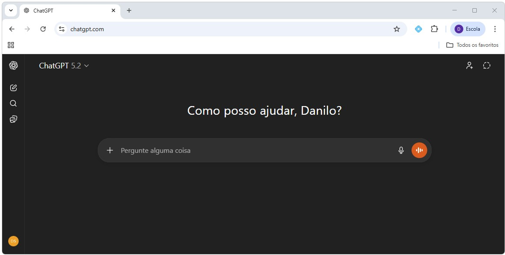
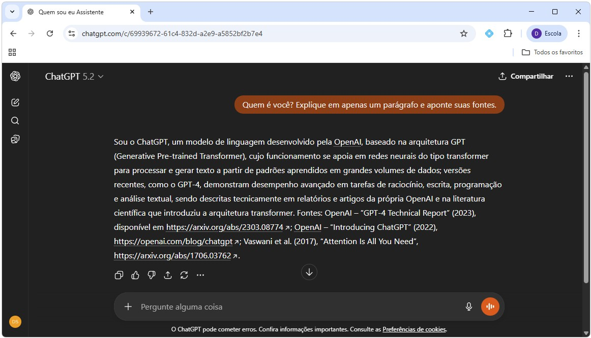
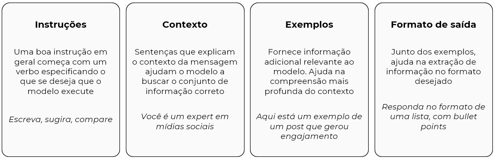
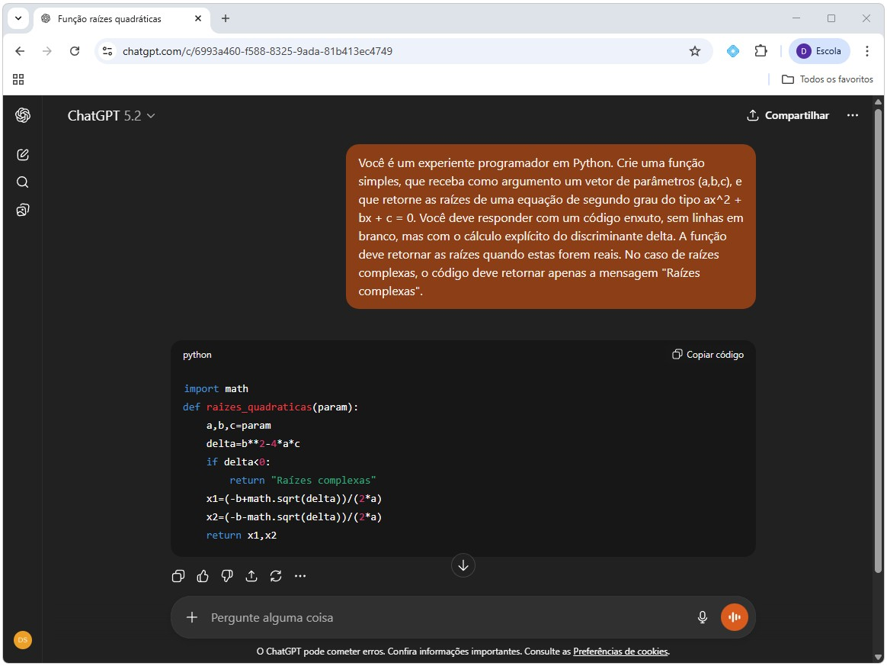
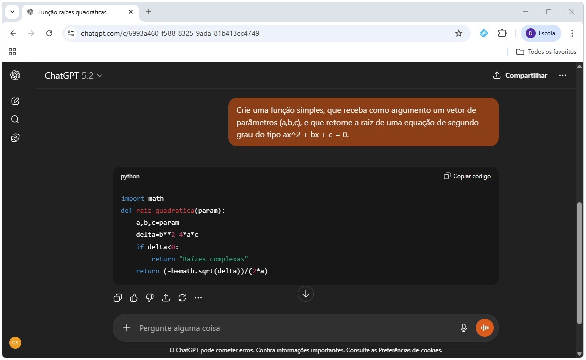
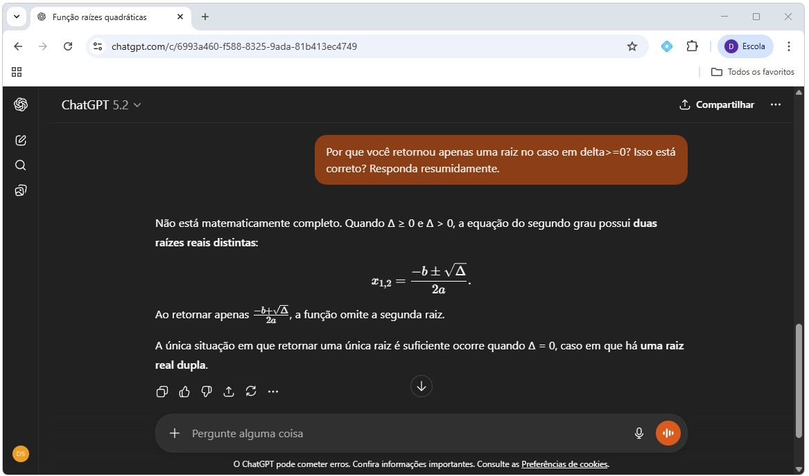

# Programação e IA {#sec-inteligencia_artificial}

## Introdução

A incorporação recente de ferramentas de inteligência artificial ao desenvolvimento de software alterou significativamente a forma como programas são escritos, depurados e documentados. Em particular, modelos de linguagem treinados em grandes volumes de código passaram a ser capazes de gerar trechos de programas, explicar erros e sugerir soluções alternativas de forma quase imediata.

Neste curso, a inteligência artificial não será tratada como um atalho para "pular" a aprendizagem de programação, mas como um instrumento complementar. O objetivo é utilizá-la para apoiar o entendimento da sintaxe, acelerar tarefas mecânicas e auxiliar na identificação de erros, sempre preservando o domínio conceitual do código pelo aluno.

{#fig-ia width=700px max-width=100% fig-align="center"}

Antes de discutir como usar essas ferramentas de forma produtiva, é necessário definir IA e aprender como acessar seus recursos. Só então podemos avançar para entender o que a IA faz bem, o que faz mal e quais riscos surgem quando ela é usada sem critério, especialmente em um contexto de formação em métodos computacionais.

### Pré-requisitos

Este foi escrito para que o aluno que acompanhou e absorveu o conteúdo do dois capítulos anteriores seja plenamente capaz de acompanhar. Não há outros pré-requisitos.

## O que é Inteligência Artificial?

Definir IA é uma tarefa difícil, já que se trata de uma área da ciência da computação bastante ampla que, a depender do contexto, envolve um conjunto de modelos e aplicações diferentes. Em todos os casos, porém, é uma área responsável por criar sistemas capazes de executar tarefas que requerem inteligência humana, como aprendizado, raciocínio, reconhecimento de padrões, processamento de áudio, vídeo e linguagem. Esses sistemas são construídos à partir de uma grande amostra de dados, nos quais diferentes modelos são treinados e à partir dos quais é possível construir previsões e análises sobre conjuntos de dados novos. Podemos citar alguns exemplos que, em geral, são aplicações de sistemas de IA: sistemas de recomendação, robótica, diagnóstico médico, sistema de previsão, automação.

Embora se discuta Inteligência Artificial há algum tempo, apenas mais recentemente a chamada Inteligência Artificial Generativa (IAG) ganhou espaço no debate e nos modelos de uso comercial. Diferentemente dos algoritmos mais gerais de inteligência artificial, os modelos de IAG são projetados para a criação de algo novo, que não estava presente nos dados originais. Em essência, os sistemas de IAG são sistemas de IA com um escopo mais restrito e bem definido.

No mundo da programação, ferramentas de IAG são especialmente eficazes em tarefas como escrever estruturas sintáticas comuns, explicar mensagens de erro frequentes ou converter descrições em linguagem natural para código simples. Essas características fazem com que a IAG seja útil como um assistente de programação, semelhante a um monitor humano muito rápido. No entanto, modelos como o ChatGPT não "sabem" programação no sentido humano. Eles operam prevendo sequências de texto com base em padrões estatísticos aprendidos durante a fase de treinamento do modelo. Isso significa que essas ferramentas podem produzir respostas plausíveis, mas não necessariamente verdadeiras. Além disso, a IAG não conhece a sequência didática adotada e não distingue soluções apropriadas de soluções excessivamente complexas para o nível do aluno. Por esse motivo, o uso indiscriminado dessas ferramentas pode gerar dependência, dificultar a internalização de conceitos básicos como tipos de dados, controle de fluxo e escopo de variáveis.

## _Large Language Models (LLMs)_

Dentro do grupo de modelos de IAG estão os famosos GPTs, como o [ChatGPT](https://chatgpt.com/) e o [Gemini](https://gemini.google.com/). Os GPTs são modelos da classe dos _Large Language Models_, que compreendem e geram conteúdo textual novo com base em uma etapa de pré-treino em grande volume de textos. Nesses modelos, o sistema recebe uma mensagem (prompt) de entrada, "raciocina" em cima do texto fornecido e dos dados nos quais foi pré-treinado, e retorna uma mensagem de saída em resposta. É como se o modelo tivesse por objetivo prever a próxima palavra (ou token) em um texto, dadas as palavras anteriores. Quando aplicados a código, esses modelos exploram regularidades presentes em milhões de exemplos de programas escritos por humanos.

É importante destacar que, embora extremamente úteis para programação, esses modelos:

- Não executam o código que geram. Eles produzem sequências de texto estatisticamente plausíveis.
- Não verificam automaticamente se o código está correto.
- Não "sabem" matemática, economia ou programação no sentido humano.
- Por vezes tendem a escolher respostas mais complexas e complicada do que o necessário.

No fundo, tais modelos apenas produzem sequências plausíveis de texto com base em padrões estatísticos. Isso explica por que respostas podem parecer convincentes, mas conter erros lógicos, uso inadequado de funções ou soluções incompatíveis com o nível do curso. Essa limitação torna essencial que o aluno atue como validador ativo de qualquer resposta produzida por IA.

::: {.callout-note title="Curiosidade"}
Você sabe o que significa GPT? É a sigla para **Generative Pre-trained Transformer**, que resume as características dos modelos por trás de sistemas como o ChatGPT. _Generative_ faz referência a modelos de IAG, que tem como objetivo principal criar conteúdo novo a partir de um dado conjunto de informações. _Pre-trained_ faz referência ao fato do modelo ser pré-treinado em um grande volume de dados textuais genéricos, em geral de domínio público como o Wikipedia, até uma determinada data de corte. Por fim, _Transformer_ é uma classe de modelos mais recentes, desenvolvidos inicialmente pelas equipes de pesquisa do Google, com certas particularidades que os tornam altamente eficientes e assertivos em tarefas que envolvem mensagens de entrada em formato de texto.
:::

## ChatGPT

### Acesso à plataforma e primeiro uso

O acesso à ferramenta é feito pelo [site](https://chatgpt.com/) ou pelo aplicativo móvel, disponível gratuitamente na Apple Store ou Google Store. A plataforma se parece com um chat qualquer, assim como um aplicativo de mensagens. A diferença é que quem responde é o próprio modelo. Assim, para fazer algum questionamento ou pedir algum auxílio com o seu código, por exemplo, basta digitar na caixa de entrada a mensagem que resume aquilo que se deseja que o modelo responda. A Figura @fig-chatgpt apresenta o layout base e como realizar uma requisição ao ChatGPT através do website.

::: {#fig-chatgpt layout-nrow=2 width=800px max-width=100% fig-align="center"}





Layout do aplicativo web do ChatGPT. Fevereiro de 2026.
:::

As requisições ao modelo são gratuitas, porém, com acesso limitado às versões mais recentes do modelo, com maior capacidade de processamento, eficácia e assertividade nas respostas. É plenamente possível utilizar a versão gratuita para requisições esporádicas e mais simples, que não envolvam mídias como aúdio ou imagens. Usuários mais intensos e que demandam respostas mais confiáveis podem se frustar com as funcionalidades da versão gratuita. A OpenAI, empresa por trás do ChatGPT, oferece alguns planos pagos que dão direito a uso ilimitado dessas novas versões do modelo e outras funcionalidades.

{#fig-chatgptplus width=700px max-width=100% fig-align="center"}

No entanto, nem sempre as ferramentas de inteligência artificial são indicadas. Existem limitações importantes que, se não compreendidas, podem gerar respostas pouco eficazes, incorretas e até mesmo implicar problemas legais. Diante dessas limitações, o uso da ferramenta em qualquer aplicação deve ser precedido por três perguntas básicas, listadas abaixo. Se qualquer uma dessas condições não for satisfeita, o uso da ferramenta deve ser reavaliado ou evitado.

1. **A acurácia é um requisito central da sua aplicação?** Embora o modelo tenha sido treinado com bilhões de textos e conjuntos de dados, não há garantia de respostas $100%$ corretas. Além disso, há um grau inerente de imprevisibilidade: pequenas variações no prompt podem gerar respostas diferentes, e o próprio modelo é não determinístico. Isso significa que, mesmo com a mesma pergunta, resultados distintos podem surgir. Para aplicações que exigem precisão rigorosa e consistência absoluta, essa limitação deve ser considerada explicitamente. 

2. **Os resultados são verificáveis?** Ferramentas como o ChatGPT não substituem conhecimento humano especializado. Por serem modelos, podem produzir respostas semanticamente plausíveis, mas incorretas ou desalinhadas do objetivo pretendido. A verificação exige domínio mínimo do tema tratado. Como regra prática: evite solicitar algo que você não tenha condições de conferir, validar ou testar posteriormente.

3. **Dados da apicação são sensíveis ou protegidos?** O compartilhamento de dados confidenciais com ferramentas de IAG pode implicar riscos jurídicos e, a depender da natureza da informação, pode inclusive configurar infração legal. Sempre avalie cuidadosamente se os dados utilizados estão protegidos por normas de sigilo, contratos ou legislação específica antes de inseri-los em qualquer sistema externo.

```{mermaid}
%%{init: {
  "theme": "base",
  "flowchart": {
    "padding": 10,
    "nodeSpacing": 30,
    "rankSpacing": 40
  },
  "themeVariables": {
    "fontSize": "20px"
  }
}}%%

flowchart TB
    A[Acurácia é importante?]
    B[Resultados são verificáveis?] 
    C[Utiliza dados sigilosos ou sensíveis?]
    D[ChatGPT é indicado!]
    N1[Arriscado utilizar ChatGPT]
    N2[Imprudente utilizar ChatGPT]
    N3[Difícil utilizar ChatGPT]

    s1["SIM"]
    n1["NÃO"]
    s2["SIM"]
    n2["NÃO"]
    s3["SIM"]
    n3["NÃO"]

    A --> s1 --> N1
    A --> n1 --> B

    B --> n2 --> N2
    B --> s2 --> C

    C --> s3 --> N3
    C --> n3 --> D

    %% Estilo opcional para reforçar aparência de árvore de decisão
    classDef decision fill:#f0f0f0,color:#000000,stroke-width:0px;
    classDef allow fill:#d1e7dd,color:#000000,stroke:#198754,stroke-width:2px
    classDef deny fill:#f8d7da,color:#000000,stroke:#dc3545,stroke-width:2px;
    classDef choice fill:#ffffff,color:#000000,stroke:#ffffff,stroke-width:0px;

    class A,B,C decision;
    class D allow;
    class N1,N2,N3 deny;
    class s1,n1,s2,n2,s3,n3 choice;

    %% Arredondamento
    style A rx:10,ry:10;
    style B rx:10,ry:10;
    style C rx:10,ry:10;
    style D rx:10,ry:10;
    style N1 rx:10,ry:10;
    style N2 rx:10,ry:10;
    style N3 rx:10,ry:10;

    linkStyle default stroke-width:1px;
```

### Conceitos básicos de engenharia de prompt

Como você já deve ter percebido, a qualidade da resposta da ferramenta de IAG depende fortemente da clareza, do contexto e das restrições explícitas incluídas na instrução (ou pergunta) enviada pelo usuário, isto é, depende da qualidade do *prompt*. Prompts vagos tendem a gerar respostas genéricas ou excessivamente complexas. Já prompts bem formulados permitem que a IA produza respostas mais alinhadas ao objetivo desejado.

_Prompt Engineering_ (ou engenharia de prompt) é o processo de estruturar uma prompt de forma a auxiliar a compreensão dos modelos de linguagem e ampliar a assertividade e eficiência das respostas. Apesar de ser uma área em expansão, que conta com várias estratégias para a construção de prompts altamente personalizados para cada aplicação, são duas as características essenciais que devem estar presentes em todo prompt: clareza e especificidade.

- **Clareza**: para tornar o prompt claro aos olhos do modelo, é preciso fornecer elementos que objetivos que auxiliem o modelo a fornecer respostas mais direcionadas. Para isso, é importante (i) descrever o contexto relevante, (ii) adicionar detalhes específicos ao objeto e (iii) ser preciso nas instruções. 

- **Especificidade**: para tornar o prompt menos genérico e melhor direcionar a resposta do modelo, é preciso que o foco seja apenas no que é mais relevante para o objetivo em questão. Prompts vagos e ambíguos promovem respostas menos acuradas e eficientes. Nesse caso, (i) seja descritivo, (ii) evite amiguidades e informações desnecessárias, (iii) evite dizer ao modelo o que não fazer; o foco deve ser em instruções do que queremos que seja feito.

No fim das contas, um bom prompt é aquele que oferece as instruções corretas ao modelo, que então devolve a resposta esperada. Alguns elementos ajudam nesse processo de construir um prompt mais claro e específico: instruções, contexto, exemplos e formato de saída (Figura @fig-prompt). Lembre, o objetivo é ser claro e específico, orientando o modelo a responder aquilo que queremos que ele responda.

{#fig-prompt width=800px max-width=100% fig-align="center"}

### Exemplo de uso em programação

A melhor forma de compreender essas diretrizes é aplicá-las na prática. A Figura @fig-bhaskara mostra o caso em que o ChatGPT é instruído a gerar um código em Python, comentado e que produza uma função (tema do Capítulo @sec-funcoes) que calcule as raízes de uma equação de segundo grau. O prompt possui instruções, contexto e orientações bem definidas em relação ao formato de saída. Note que, no caso de raízes complexas, a ferramenta é instruída a emitir uma mensagem de erro no console da IDE utilizada.

{#fig-bhaskara width=800px max-width=100% fig-align="center"}

Um prompt ligeiramente diferente, com um grau menor de clareza e espaço para ambiguidades, pode produzir resultados com a sintaxe correta mas semanticamente errados, isto é, que "rodem" mas levem a uma conclusão errada. No exemplo abaixo (Figura @fig-bhaskara2), o prompt foi alterado de forma deliberada para pedir que a função "retorne a raiz" ao invés de "retorne as raízes". Na maioria das vezes, a ferramenta não vai apontar o erro matemático, produzindo como resposta um código com a sintaxe correta mas que produza uma resposta matematicamente incorreta. A Figura @fig-bhaskara3 confronta o ChatGPT, que explica a decisão em relação a resposta anterior.

{#fig-bhaskara2 width=800px max-width=100% fig-align="center"}

{#fig-bhaskara3 width=800px max-width=100% fig-align="center"}

## Riscos e limitações do uso de IA 

O principal risco do uso de IA no aprendizado de programação é a ilusão de compreensão. Códigos gerados automaticamente podem funcionar, mas isso não implica que o aluno compreenda sua lógica ou consiga reproduzi-la em outra situação.

Outros riscos relevantes incluem:

- Geração de código incompatível com o problema e nível de conhecimento.
- Soluções ineficientes ou computacionalmente custosas.
- Erros semânticos, que não impedem o código de rodar, mas geram resultados incorretos em vista dos objetivos.

Por esses motivos, qualquer código sugerido por IA deve ser lido com atenção, executado e testado, e comparado com o que foi visto em aula. A regra prática é simples: se você não conseguir reconstruir ou adaptar a solução sem a ferramenta de IA, então você não compreendeu a resposta recebida e a ferramenta não deveria ter sido utilizada daquela forma ou para aquele problema.

## Conclusão

A IA representa uma mudança fundamental na forma como programamos, mas não elimina a necessidade de compreender os fundamentos da computação. Neste curso, a IA deve ser encarada como uma ferramenta auxiliar, útil para esclarecer dúvidas, acelerar tarefas mecânicas e apoiar o processo de aprendizagem, desde que usada de forma crítica e consciente.

O domínio de programação em Python exige prática, leitura de código, compreensão de erros e construção gradual de raciocínio algorítmico. Nenhuma ferramenta de IA substitui esse processo. Quando usada corretamente, no entanto, ela pode torná-lo mais eficiente e menos frustrante. Nos próximos capítulos, o foco retorna integralmente ao desenvolvimento dessas habilidades fundamentais, que serão a base para todas as aplicações computacionais em Economia ao longo do curso.

## Exercícios

1. X

2. X