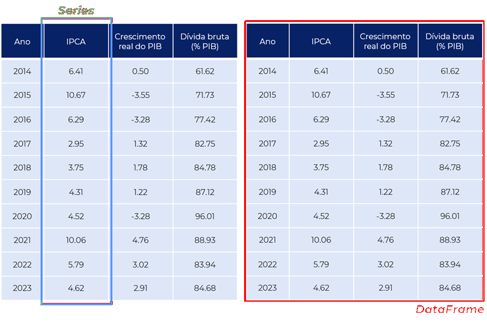
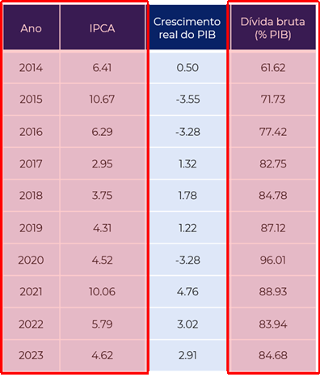
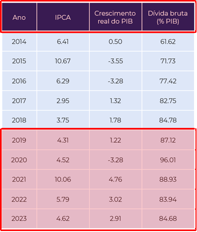
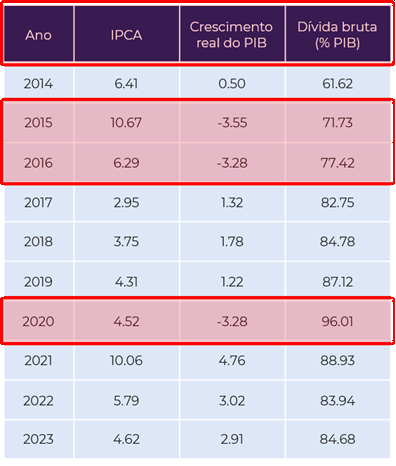

# Gestão e análise de dados {#sec-pandas}

## Introdução

Até agora trabalhamos principalmente com objetos isolados: números, strings, listas e arrays. Em aplicações empíricas reais, porém, os dados normalmente aparecem organizados em tabelas, nas quais cada linha representa uma observação e cada coluna representa uma variável. O pacote `Pandas` foi criado justamente para facilitar a manipulação desse tipo de estrutura. Ele fornece ferramentas para importar, filtrar, transformar, combinar e resumir bases de dados de forma eficiente.

Em economia aplicada, praticamente todo trabalho empírico utiliza operações desse tipo: selecionar municípios, combinar bases administrativas, calcular médias por grupo, tratar valores ausentes e reorganizar dados antes de estimar modelos econométricos.

{#fig-olddesk width=800px max-width=100% fig-align="center"}


### Pré-requisitos

Para trabalhar com funções e todas as suas funcionalidades, utilizaremos dois pacotes externos:

- `numpy`
- `pandas`
- `os`

```{python}
#| message: false
#| warning: false

import numpy as np
import pandas as pd
import os
```

```{python}
#| echo: false
from IPython.display import display, HTML

pd.set_option('display.max_columns', 10)

display(HTML("""
<style>
table.dataframe td {
    text-align: center;
}
table.dataframe th {
    text-align: center;
}
</style>
"""))
```


## O que é o Pandas?

Pandas é uma biblioteca que contém objetos específicos e ferramentas próprias a esses objetos que permitem realizar limpeza, organização e análise de dados de forma bastante eficiente no Python. Não à toa, é uma das bibliotecas mais utilizadas na linguagem hoje em dia, um pré-requisito para a maior parte das aplicações de ciência dos dados e aprendizado de máquina.

Embora o Pandas se utilize em grande medida da estrutura e lógica do NumPy e seus arrays, a biblioteca é projetada para trabalhar com dados tabulares e heterogêneos. Como já vimos, o NumPy é mais adequado para trabalhar com dados homogêneos e em sua maior parte numéricos. Se por um lado o NumPy tem como objetos principal o `ndarray`, são dois os objetos particulares ao Pandas: `Series` e `DataFrame`.

Você pode pensar em uma série como uma coluna de dados, como uma sequência de observações em uma única variável. Por outro lado, um DataFrame é um objeto bidimensional para armazenar colunas de dados relacionadas, assim como uma tabela do Microsoft Excel, com linhas que identificam a qual entidade as informações das colunas se referem. A Figura @fig-dataframe ilustra essa diferença.

{#fig-dataframe width=800px max-width=100% fig-align="center"}

## Objetos no Pandas

Existem várias formas de criar esses objetos no Pandas. A primeira forma é faze-lo manualmente, através de listas e dicionários que armazenem os dados. Vamos começar criando duas listas: uma contendo o número de pessoas ocupadas (em mil pessoas) no Brasil de 2012 a 2021 e outra contendo exatamente o intervalo de anos. 

```{python}
pessoas_ocupadas = [90593,92170,92962,92366,90174,92228,93534,95515,87225,95747]
anos = list(range(2012,2021+1))

print(pessoas_ocupadas)
print(anos)
```

Para criar uma série basta utilizar a função `pandas.Series`, que recebe como argumento os valores da série e os índices da série, que serão justamente os valores que identificam cada linha.

```{python}
series_pessoas_ocup = pd.Series(data=pessoas_ocupadas,index=anos)

print(type(series_pessoas_ocup),'\n')
print(series_pessoas_ocup)
```

Já para o caso de um DataFrame, podemos criá-lo através da função `pandas.DataFrame`. Essa função recebe os dados que irão compor as colunas de dados de diversas formas, mas umas das mais intuitivas é através da utilização de dicionários. Seguindo o exemplo anterior, vamos criar um DataFrame com as informações de pessoas ocupadas, desocupadas, dentro e fora da força de trabalho. Primeiro passo é definir o dicionário com esses dados. 

```{python}
dados = {
    'ocupadas': [90593,92170,92962,92366,90174,92228,93534,95515,87225,95747],
    'desocupadas': [6730,6151,6555,9222,12476,12453,12413,11903,14412,12011],
    'na forca': [97322,98321,99516,101588,102650,104682,105947,107418,101637,107758],
    'fora da forca': [58007,59244,60162,60092,60953,60777,61299,61579,69042,64525]
}

print(dados)
```

Agora basta definir o DataFrame usando como argumento esse dicionários `dados`.

```{python}
dados_emprego = pd.DataFrame(data=dados,index=anos)

print(type(dados_emprego),'\n')
dados_emprego.head()
```

## Importação de dados externos

Um dos principais pontos fortes do Pandas é justamente a capacidade de importar e exportar informações nos mais diversos formatos: planilhas de Microsoft Excel (`.xlsx`), arquivos de texto separado por vírgulas (`.csv`), etc. Mais do que trabalhar com esses arquivos, o Pandas o faz de maneira eficiente e em poucas linhas de código. Funções como `read_csv` e `to_csv`, por exemplo, são essenciais para o conjunto de ferramentas do cientista de dados em Python.

A ideia daqui para frente é trabalhar com os dados da [Penn World Table version 11.0](https://www.rug.nl/ggdc/productivity/pwt/?lang=en), base de dados com informação sobre níveis de renda, produto e produtividade de mais de 180 países durante o período de 1950 a 2023. Esses dados são mantidos pela Universidade de Groningen e atualizados periodicamente. O arquivo específico com o qual trabalharemos está disponível no Moodle e deve ser baixado para a sua máquina local.

Mas antes de aprendermos como trabalhar com um dataframe e as funcionalidades que o Pandas nos traz precisamos ler o arquivo com os nossos dados. Comecemos pela função `os.chdir` do pacote `os` para mudar o diretório base do Python para o diretório no qual o nosso arquivo se encontra:

```{python}
#| echo: false
os.chdir('D:/Dropbox')
```

```{python}
# Qual o diretório no qual o Python está trabalhando? A função getcwd() nos diz isso
print('Diretório inicial: {}'.format(os.getcwd()))

# Vamos mudar para o nosso diretório atual
os.chdir('C:/Users/user/Desktop/EAE1106')
print('Diretório final: {}'.format(os.getcwd()))
```

Quais são os arquivos disponíveis nesse diretório? A função `os.listdir()` lista as pastas e arquivos disponíveis no diretório que estamos trabalhando.

```{python}
os.listdir()
```

Agora utilizaremos a função `pandas.read_csv` para ler o arquivo `pwt110_selected.csv`. Esse arquivo contém informações selecionadas para os 185 países da amostra. Além do nome do arquivo, passamos dois argumentos adicionais para a função: `sep` e `encoding`.

O argumento `sep` define qual caractere é utilizado para separar as colunas do arquivo. Embora arquivos _CSV_ frequentemente utilizem vírgulas como separador (_Comma-Separated Values_), é bastante comum encontrar bases em que os valores são separados por ponto e vírgula ou outros caracteres especiais. Nesse caso, utilizamos `sep=';'` para informar ao pandas que as colunas devem ser identificadas a partir desse separador.

Já o argumento `encoding` especifica a codificação de caracteres utilizada no arquivo. A codificação define como letras, números e símbolos são armazenados internamente no computador. Utilizar a codificação correta é particularmente importante quando a base contém acentos e outros caracteres especiais. Aqui utilizamos `encoding='utf8'`, uma das codificações mais comuns atualmente e amplamente compatível com diferentes sistemas operacionais e aplicações.

```{python}
df_pwt = pd.read_csv('pwt110_selected.csv', sep=';', encoding='utf8')
type(df_pwt)
```

A função `read_csv` faz parte de um conjunto bastante amplo de funções de importação e exportação de dados disponíveis no pandas. Mais adiante retomaremos esse tema ao estudar as funções `to_`, utilizadas para exportar tabelas e resultados produzidos durante a análise para os mais diferentes formatos disponíveis.

## _DataFrames_: o coração do Pandas

A partir deste ponto começaremos a explorar com mais profundidade o objeto central da biblioteca: o DataFrame. É nele que normalmente realizamos a maior parte do trabalho empírico, como seleção de observações, criação de variáveis, agrupamentos e análises descritivas.

Como dito anteriormente, um DataFrame pode ser entendido como uma tabela bidimensional semelhante a uma planilha do Excel ou a uma base de dados estatística, em que cada linha representa uma observação e cada coluna representa uma variável. O pandas fornece uma grande quantidade de métodos específicos para manipular esse tipo de estrutura de maneira eficiente e relativamente intuitiva.

### Características básicas

Alguns métodos específicos ao objeto DataFrame nos são incrivelmente úteis quando queremos ter uma leitura rápida do que acabamos de gerar.

- `df.info()` nos retorna algumas informações técnicas do dataframe `df`, como o formato dos dados presentes em cada coluna.

```{python}
df_pwt.info(memory_usage='deep')
```

- `df.head(n)` e `df.tail(n)` nos retornam as `n` primeiras e `n` últimas linhas, respectivamente.

```{python}
df_pwt.head(2) # método para apresentar apenas as primeiras duas linhas do dataframe
```

Ué, mas não são 14 colunas? Onde estão todas elas? Por padrão o pandas mostra apenas uma parcela do total, para alterar essas opções basta utilizar a função `pd.set_option` e mudar o argumento relacionado ao número máximo de colunas.

```{python}
pd.set_option('display.max_columns', 100)
df_pwt.head(2)
```

- `df.describe()` nos retorna uma tabela de estatísticas descritivas das colunas numéricas.

```{python}
df_pwt.describe()
```

Uma outra coisa que pode ser bastante interessante é saber quantas vezes os valores de determinada variável se repetem. Para isso é preciso primeiro selecionar uma coluna específica do DataFrame, o que é feito utilizando a lógica de dicionários em que o nome de uma coluna é como uma chave associada a uma lista de valores. A partir da seleção da coluna, basta aplicar o método `value_counts`. A título de exemplo, vejamos quantas vezes cada país da base de dados aparece no DataFrame.

```{python}
df_pwt['country'].value_counts()
```

As opções `normalize` e `dropna` nos permitem, respectivamente, olhar para frequência relativa, ao invés de absoluta, e excluir da tabulação as observações em que o valor da coluna `country` nao está disponível, isto é, é _missing_.

```{python}
df_pwt['country'].value_counts(normalize=True,dropna=False)
```

### Seleção e filtragem

Por vezes pode ser interessante selecionar e filtrar os dados que temos de acordo com algum interesse específico.

::: {#fig-select layout-ncol=3 width=800px max-width=100% fig-align="center"}







Exemplo de seleção e filtragem
:::

São várias as formas, umas mais diretas e outras mais poderosas, de realizar esse tipo de operação no Python. Mas vamos começar do começo aqui. A forma mais simples de selecionar um intervalo particular de linhas do DataFrame é através da lógica de indexação de sequências ordenadas, como listas, tuplas ou mesmo arrays. Para o caso em que estejamos interessados em selecionar apenas as duas primeiras linhas do DataFrame basta utiliza o código abaixo:

```{python}
df_pwt[0:2]
```

No entanto, para selecionar um intervalo específico de linhas e colunas, a lógica de indexação que utilizamos com arrays de duas dimensões no NumPy não se aplica. Para tal, precisamos de alguns métodos de DataFrames. Utilizando a função `.iloc` podemos selecionar linhas e colunas com os índices numéricos. E se quisermos, por exemplo, manter todas as linhas mas apenas as colunas `country`, `currency_unit`, `year`, `pop`, `emp` e `rgdpna`? Lembre-se que quando o Python lida com intervalos, na grande maioria das vezes a linguagem inclui o índice de início do intervalo mas exclui o índice final.

```{python}
df_pwt.iloc[:,1:7]
```

Uma outra forma de fazer exatamente a mesma seleção é através do método `.loc`. A diferença é que nesse caso utilizamos uma mistura de índices numéricos para as linhas e seleção das colunas através de seus nomes.

```{python}
columns_to_keep = ['country','currency_unit','year','pop','emp','rgdpna']

df_pwt.loc[:, columns_to_keep]
```

Uma terceira forma de fazer esse exercício de seleção de uma parte de um DataFrame já criado é através da criação de um novo DataFrame que mantenha apenas as colunas de interesse. Importante, nesse caso, usar o método `copy` para garantir a criação de uma cópia, um novo dataframe, e evitar que alterações no dataframe original afetam o segundo dataframe e vice-versa.

```{python}
df_pwt2 = df_pwt[columns_to_keep].copy()

df_pwt2.head()
```

Podemos inclusive alterar o nome das colunas desse novo DataFrame de forma bem direta.

```{python}
df_pwt2.columns = ['pais','moeda','ano','populacao (milhoes)','pessoas empregadas (milhoes)','PIB real em valores de 2021 (milhoes US$)']
df_pwt2.head()
```

Legal, mas ainda não falamos nada sobre filtrar partes do DataFrame de acordo com determinada condição e valores das colunas. Para filtrar linhas de acordo com resultados de testes condicionais, basta construir o teste dentro dos colchetes que seguem o nome do dataframe. Assim como já fizemos outras vezes, os testes podem ser aninhados na hora de fazer a filtragem.

- Selecionar apenas os dados brasileiros

```{python}
cond1 = df_pwt2['pais']=='Brazil'

df_pwt2[cond1].head()
```

- Selecionar os dados brasileiros e apenas à partir do ano 2000.

```{python}
cond2 = df_pwt2['ano']>=2000

df_pwt2[(cond1) & (cond2)].head()
```

- Selecionar os dados do Brasil e Estados Unidos

```{python}
cond1 = df_pwt2['pais'].isin(['Brazil','United States'])

df_pwt2[cond1].head()
```

### Operações com colunas numéricas

Criar colunas novas ou mesmo alterar colunas já existentes quando o tipo de dado é numérico é uma tarefa bastante simples. As operações são feitas como se fosse operações de arrays do NumPy, em que uma coluna se comporta tal qual um array de uma única dimensão. Vejamos alguns exemplos de operações a partir de um novo DataFrame com dados brasileiros.

```{python}
# O método reset_index nesse caso, serve para renumerar as linhas a partir do zero.
df_pwtbr = df_pwt2[df_pwt2['pais']=='Brazil'].reset_index()

df_pwtbr.head()
```

- Coluna com o PIB real per capita

```{python}
df_pwtbr['pibpc'] = df_pwtbr['PIB real em valores de 2021 (milhoes US$)'] / df_pwtbr['populacao (milhoes)']

columns_to_show = ['ano','populacao (milhoes)','PIB real em valores de 2021 (milhoes US$)','pibpc']
df_pwtbr[columns_to_show].head()
```

- Coluna com o log do PIB per capita

```{python}
df_pwtbr['log_pibpc'] = np.log(df_pwtbr['pibpc'])

columns_to_show = ['ano','pibpc','log_pibpc']
df_pwtbr[columns_to_show].head()
```

- Coluna com o PIB per capita em milhares de dólares

```{python}
df_pwtbr['pibpc_th'] = df_pwtbr['pibpc'] / 1000

columns_to_show = ['ano','pibpc','pibpc_th']
df_pwtbr[columns_to_show].head()
```

- Calcular a razão entre pessoas empregadas e a população. Subtrair a média dessa razão da coluna original para encontrar o desvio da razão em relação à média.

```{python}
df_pwtbr['r_emppop'] = df_pwtbr['pessoas empregadas (milhoes)'] / df_pwtbr['populacao (milhoes)']
df_pwtbr['r_emppop'] = df_pwtbr['r_emppop'] - df_pwtbr['r_emppop'].mean()

columns_to_show = ['ano','r_emppop','r_emppop']
df_pwtbr[columns_to_show].head()
```

Para realizar outras operações simples de soma, subtração, multiplicação e divisão a lógica é a mesma, independente de ser uma operação entre colunas ou de uma coluna com um escalar. Para operações mais complexas, no entanto, o método `.apply` em conjunto com funções anônimas do tipo `lambda` constituem uma ferramenta poderosíssima.

- Calcular a raiz quadrada da população

```{python}
df_pwtbr['pop_sqrt'] = df_pwtbr['populacao (milhoes)'].apply(lambda x: ((x*1000000)**0.5))

columns_to_show = ['ano','populacao (milhoes)','pop_sqrt']
df_pwtbr[columns_to_show].head()
```

Para visualizar melhor, vamos focar no último valor, representado pelo índice 100.

```{python}
print(df_pwtbr.loc[10,'populacao (milhoes)'])
print(df_pwtbr.loc[10,'pop_sqrt'])
print((df_pwtbr.loc[10,'populacao (milhoes)'] * 1000000)**0.5)
```

Fizemos apenas alguns exemplos bastante simples, mas note a força que o método `apply` tem quando trabalhado em conjunto com as funções `lambda`. O céu é o limite.

### Operações com colunas não-numéricas

O Pandas também nos fornece métodos e funções bastante interessantes para trabalhar com dados do tipo `string`. Para trabalhar com essas funções/métodos precisamos primeiro dizer ao Pandas que a coluna de interesse receberá operações específicas a strings através do sufixo `str`. Podemos aplicar a maior parte dos métodos de strings que conhecemos (`lower`, `replace`, `starswith`, etc.) utilizando essa sintaxe. Vamos começar com um exemplo simples: transformando a nossa coluna com o nome dos países para um coluna com letras minúsculas apenas. 

```{python}
df_pwtbr['lower_pais'] = df_pwtbr['pais'].str.lower()

columns_to_show = ['pais','lower_pais','ano']
df_pwtbr[columns_to_show].head()
```

Podemos aplicar a maior parte dos métodos de strings que já vimos (`replace`,`starswith`,`strip`,`extract`, etc.) utilizando essa sintaxe. Brinque um pouco com isso.

Uma outra funcionalidade interessante é a possibilidade de criação de novas colunas de strings utilizando dicionários. Podemos, por exemplo, utilizar essa funcionalidade para criar uma nova coluna que mostre se razão de participação no mercado de trabalho em determinado ano está acima ou abaixo do 3º quartil da distribuição. 

```{python}
df_pwtbr['r_emppop'].describe()
```

```{python}
# criando coluna a partir de list comprehension
df_pwtbr['remppop_p75bool'] = [True if x>=100 else False for x in df_pwtbr['r_emppop']]

# criando coluna a partir de um dicionario
quartil_sup = {
    True:'Acima do 3º quartil',
    False:'Abaixo do 3º quartil'}

df_pwtbr['remppop_p75cat'] = df_pwtbr['remppop_p75bool'].apply(lambda x: quartil_sup[x])
```

E qual é o resultado final?

```{python}
columns_to_show = ['ano','r_emppop','remppop_p75bool','remppop_p75cat']
df_pwtbr[columns_to_show].head()
```

### Agrupamento de dados

Suponha que queiramos calcular médias por década do PIB per capita, da razao de participação no mercado de trabalho e salvar isso em um novo dataframe. Vamos fazer isso para os dados brasileiros e norte-americanos de forma separada. Primeiro passo então é criar esses dataframes por país.

```{python}
df_pwt2['decada'] = np.trunc(df_pwt2['ano']/10) * 10
df_pwt2['pibpc'] = df_pwt2['PIB real em valores de 2021 (milhoes US$)'] / df_pwt2['populacao (milhoes)']
df_pwt2['r_emppop'] = df_pwt2['pessoas empregadas (milhoes)'] / df_pwt2['populacao (milhoes)']

columns_to_keep = ['pais','decada','pibpc','r_emppop']

df_pwtdbr = df_pwt2.loc[df_pwt2['pais']=='Brazil', columns_to_keep]
df_pwtdus = df_pwt2.loc[df_pwt2['pais']=='United States', columns_to_keep]

df_pwtdbr.head(2)
```

Uma vez criado os dataframes individuais, o passo seguinte é "condensar" cada dataframe individual de acordo com valores específicos de um conjunto de colunas e usando o operador média como forma de realizar essa operação de achatamento. Para esse objetivo, devemos utilizar o método `groupby`. Atenção para a diferença quando definimos o parâmetro `as_index` para igual a `False`.

```{python}
df_pwtdbr = df_pwtdbr.groupby(by=['pais','decada']).mean()
df_pwtdbr.head(5)
```

```{python}
df_pwtdus = df_pwtdus.groupby(by=['pais','decada'], as_index=False).mean()
df_pwtdus.head(5)
```

Note que... Mas como não queremos o nome do país como indice, vamos redefinir o dataframe do Brasil

```{python}
df_pwtdbr.reset_index(inplace=True)
df_pwtdbr.head(5)
```

### Junção e mesclagem

Note que fizemos um dataframe para o Brasil e outro para os Estados Unidos. Podíamos ter feito tudo junto? Com certeza. Mas fizemos dessa forma justamente para mostrar outra funcionalidade bastante importante quando trabalhamos com bases de dados: a junção de duas bases diferentes. Embora tenhamos trabalhado com dados contidos em dataframes ``completos'', é bastante comum utilizarmos várias bases de dados diferentes ao mesmo tempo e que contenham dados de alguma forma relacionados. São duas as principais formas de fazer esse tipo de operação:

- Adicionar dados com as mesmas colunas, mas contendo informação sobre entidades diferentes.
- Adicionar dados das mesmas entidades, mas contendo informação inexistente nas colunas da base original.

A função `concat` serve ao propósito de adicionar o mesmo conjunto de informações, mas de novas entidades. É como se essa função ``somasse'' duas bases, criando uma nova base que apenas junta as linhas dos diferentes dataframes. Isso é muito útil, por exemplo, quando geramos dataframes dentro de um loop e queremos ir juntando cada novo dataframe a um grande e único.

```{python}
df_pwt_concat = pd.concat(objs=[df_pwtdbr, df_pwtdus]).reset_index(drop=True)

df_pwt_concat
```

Para compreender completamente o segundo caso, é preciso entender que existem formas diferentes de adicionar novas informações às entidades existentes. E a teoria dos conjuntos nos ajuda a entender melhor como isso funciona. Utilizando uma coluna (ou colunas) que identifiquem unicamente pelo menos uma das bases de dados (A ou B) é possível unir as informações de modo a compor um único dataframe. É preciso, porém, ter claro o objetivo da mesclagem. Assim será possível definir quais dos casos que mais se encaixa ao problema em questão. A Figura @fig-merge ilustra os diferentes casos.

{#fig-merge width=400px max-width=100% fig-align="center"}

Agora sim podemos dar um passo adiante e utilizar a função `merge` para unir as bases do Brasil e EUA. Essa função une duas bases de acordo com algum identificador e com algum método de união. O identificador pode vir do índice do dataframe ou mesmo de alguma coluna específica.  No nosso caso utilizaremos a coluna de década como identificadora através do parâmetro `on`. Falta definir agora como a junção será feita ou como lidar com os casos em que um valor da coluna identificadora aparece apenas em uma das bases de dados. Como desejamos manter apenas as observações que estão presentes em ambos os dataframes, utilizamos o valor `inner` no parâmetro `how`.

```{python}
df_pwt_merge = pd.merge(df_pwtdbr, df_pwtdus, how='inner', on=['decada'])

df_pwt_merge
```

Mas note que existem colunas com o mesmo nome nas bases do Brasil e EUA. Por padrão o pandas renomeia essas colunas com `_x` e `_y`. Primeiro, podemos começar excluindo as colunas `pais_x` e `pais_y`, que deixam de fazer sentido após o merge. Depois disso, podemos renomear as outras colunas utilizando dicionários, uma forma alternativa ao que fizemos anteriormente.

```{python}
df_pwt_merge.drop(columns=['pais_x','pais_y'], inplace=True)

dict_rename = {
    'pibpc_x':'pibpc_br',
    'r_emppop_x':'r_emppop_br',
    'pibpc_y':'pibpc_us',
    'r_emppop_y':'r_emppop_us'}

df_pwt_merge.rename(columns=dict_rename, inplace=True)

df_pwt_merge.head()
```

## Exportando o DataFrame

Já falamos de importação de dados

Por fim, a última coisa que gostaríamos de aprender nesse aulão de Pandas é como salvar o dataframe, resultado de todas as nossas operações, para um novo `csv` ou arquivo de qualquer outro tipo. Assim como tínhamos funções do tipo `read_csv` para trazer arquivos de fora, temos métodos do tipo `to_csv` para salvar um dado dataframe em um novo arquivo a ser utilizado em outros softwares.

A sintaxe é bastante simples:


```{python}
df_pwt_merge.to_csv('df_resultado_aula_pandas.csv', sep=',', encoding='utf8', index=False)

os.listdir()
```

Olha o arquivo que geramos aí, minha gente! 

Tente exportar o dataframe em outros formatos e importá-lo em outros softwares. Lembre-se, assim como quando queremos aprender novas línguas como inglês, alemão ou mandarim, em programação a fluência chega apenas com muito treino, tentativa e erro.


## Eficiência e _dtypes_

DataFrames podem ser objetos bastante pesados, com milhões de linhas e milhares de colunas. Isso por vezes pode ser um problemão para nós. Existem bibliotecas que servem ao propósito de trabalhar de forma mais eficiente com bases de dados muito grandes (e.g., [`Dask`](https://www.dask.org/)), mas algumas funções dentro do próprio Pandas já conseguem nos ajudar bastante em grande parte das situações.

Vamos trabalhar com uma outra base de dados a partir de agora

No entanto, os tipos de dados de cada coluna não nos parecem os mais adequados. Uma coluna do tipo `float64` consume 4x mais memória do que uma coluna do tipo `float16` e 8x mais memória do que uma coluna do tipo `int8`, por exemplo. Da mesma forma, uma coluna do tipo `object` consome muito mais memória do que uma coluna que o Pandas entende como do tipo categórica em grande parte dos casos. Mas o que são esses tipos todos?

- **int8 / uint8**: consome 1 byte (8-bit) de memória, o valor numérico deve ser inteiro e estar no intervalo $[-128 , 127]$ / $[0 , 255]$
- **int16 / uint16**: consome 2 bytes de memória, o valor numérico deve ser inteiro e estar no intervalo $[-32768 , 32768]$ / $[0,65535]$
- **int32 / uint32**: consome 4 bytes de memória e aceita valores numéricos inteiros com até 10 dígitos, da ordem de 2 bilhões.
- **int64 / uint64**: consome 8 bytes de memória e aceita valores numéricos inteiros ainda maiores.
- **float16 / float32 / float64**: consome 2, 4 e 8 bytes de memória, respectivamente, e aceita valores com casas decimais delimitado pelos mesmos intervalos dos tipos anteriores.
- **bool**: consome 1 byte de memória e aceita apenas dois valores `True` e `False`.
- **object**: o quanto consome de memória pode variar, mas, por aceitar valores numéricos e strings de todo tipo, consome ao menos 8 bytes de memória.
- **category**: o quanto consome de memória pode variar e depende da relação entre o número de valores únicos na coluna e o número de linhas de dados.

Beleza, devemos fugir do tipo `object` e tentar reduzir as colunas numéricas para tipos menos demandantes em termos de memória. Como fazer isso? A função `astype` é nossa companheira nesse caso.


Reduzimos mais um pouco o comprometimento de memória, embora a diferença não tenha sido tão grande. Em dataframes com milhões de linhas e milhares de colunas, no entanto, essa redução pode fazer toda a diferença. Dica: dê uma olhada na função `pandas.to_numeric` e no argumento `downcast` caso você não saiba para qual tipo de dado numérico deve ir.

No fim das contas, parte importante da estratégia de otimização na gestão de memória de dataframes vem de conhecermos os tipos mais adequados de dados para cada coluna **antes** da leitura do dataframe. Isso pode ser feito lendo primeiro um amostra de poucas linhas (e.g., 10 ou 20) do dataframe com o qual iremos trabalhar para entender a base de dados e só a partir daí ler o dataframe completo com a função `read_csv` (ou similar) e passar uma lista de tipo de dados ao argumento `dtype` (exemplo do algoritmo [aqui](https://vincentteyssier.medium.com/optimizing-the-size-of-a-pandas-dataframe-for-low-memory-environment-5f07db3d72e)). Tente isso em casa! **E não se esqueça: fuja de dados do tipo `object`!**

## Polars: uma alternativa moderna


## Conclusão

Neste capítulo introduzimos o `Pandas`, principal ferramenta de manipulação de dados em Python. Com ela, passamos a trabalhar com bases tabulares semelhantes às utilizadas em aplicações empíricas reais. As operações estudadas, como filtragem, transformação, agrupamento e combinação de bases, formam o núcleo do processo de preparação de dados em projetos de pesquisa. Nos próximos tópicos, utilizaremos essas estruturas para construir visualizações e realizar análises estatísticas mais completas.

## Exercícios

1. X

2. X