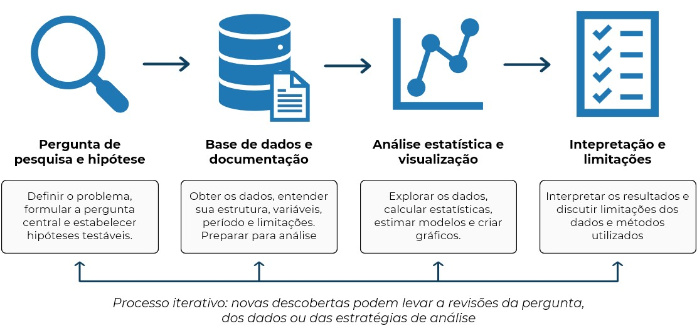

# Análise empírica integrada {#sec-projeto_empirico}

## Introdução

Até este ponto do curso, introduzimos separadamente os principais componentes de um fluxo moderno de trabalho em ciência de dados aplicada à Economia: manipulação de objetos em Python, estruturas de controle, funções, programação numérica, manipulação de bases de dados e visualização de informações. No entanto, aplicações reais raramente aparecem de forma fragmentada. Em projetos empíricos concretos, todas essas ferramentas precisam ser combinadas de maneira organizada, coerente e replicável.

O objetivo deste capítulo é integrar os conteúdos estudados anteriormente em um projeto empírico completo, simulando as etapas normalmente encontradas em trabalhos acadêmicos, relatórios técnicos, pesquisas aplicadas e análises de dados no mercado de trabalho. A proposta não é apenas “rodar códigos”, mas desenvolver uma estrutura organizada de trabalho computacional capaz de produzir resultados confiáveis, interpretáveis e reproduzíveis.

Em Economia aplicada, grande parte do trabalho empírico consiste em transformar dados brutos em evidência quantitativa. Isso envolve decisões metodológicas, organização de arquivos, documentação adequada, limpeza de dados, análise estatística e comunicação de resultados. Pequenos erros em qualquer uma dessas etapas podem comprometer completamente uma análise. Por esse motivo, projetos empíricos exigem não apenas conhecimento estatístico, mas também boas práticas de programação e gestão computacional.

### Pré-requisitos

Para implementar um projeto empírico no Python são vários os pacotes que serão utilizados. E essa é justamente uma das belezas de linguagens com uma comunidade tão ativa e produtiva como do Python: independente do tipo e complexidade do projeto, é alta a chance de pacotes específicos ao propósito do projeto em questão já terem sido desenvolvidos. No exemplo do capítulo, farei uso de pacotes básicos de gestão de sistema, bases de dados, análise estatística e visualização.

- `os`
- `pandas`
- `statsmodels`
- `matplotlib`

```{python}
#| message: false
#| warning: false

import os
import pandas as pd
import statsmodels.api as sm
import matplotlib.pyplot as plt
```

## A estrutura de um projeto empírico

Projetos empíricos são o principal instrumento utilizado por economistas para transformar dados em evidência quantitativa. Seja em pesquisas acadêmicas, relatórios técnicos, estudos de mercado ou avaliações de políticas públicas, o objetivo central é utilizar informações observáveis para responder a uma pergunta de interesse e produzir conclusões fundamentadas.

Embora os detalhes variem de acordo com o problema analisado, a disponibilidade de dados e os métodos empregados, a maioria dos projetos empíricos segue uma estrutura relativamente semelhante. Em geral, o trabalho começa com a definição de uma pergunta de pesquisa e de uma hipótese a ser investigada. Em seguida, é necessário obter, compreender e organizar os dados relevantes para a análise. Com a base preparada, realizam-se análises estatísticas e visualizações que permitam explorar padrões e relações entre as variáveis. Por fim, os resultados são interpretados à luz da pergunta original, reconhecendo as limitações dos dados e dos métodos utilizados.

Essa sequência de etapas não deve ser vista como um processo completamente linear. Frequentemente, descobertas feitas durante a análise exigem revisões na definição da hipótese ou motivam novas consultas à documentação da base de dados. Em outras palavras, projetos empíricos envolvem um processo iterativo de investigação, no qual perguntas, dados e resultados são continuamente confrontados.

{#fig-projeto width=700px max-width=100% fig-align="center"}

Além das técnicas estatísticas propriamente ditas, um projeto empírico também exige organização e planejamento computacional. A forma como arquivos são armazenados, scripts são estruturados e resultados são documentados influencia diretamente a eficiência do trabalho e a capacidade de reproduzir a análise no futuro. Por esse motivo, boas práticas de programação e gestão de projetos são componentes fundamentais da pesquisa empírica moderna.

Nas próximas seções, examinaremos cada uma das etapas que compõem um projeto empírico típico, desde a formulação da pergunta de pesquisa até a interpretação dos resultados obtidos.

## Etapas de desenvolvimento

### Pergunta de pesquisa e hipótese

Todo projeto empírico começa com uma pergunta bem definida. Em aplicações reais, o objetivo da análise não é simplesmente "usar uma base de dados", mas responder a uma questão específica utilizando evidência quantitativa. Um bom exemplo é entender a relação entre policiamento e crime. De acordo com os modelos de escolha racional da atividade criminosa, propostos inicialmente com as contribuições seminais de @becker1968 e @ehrlich1973, um policiamento maior aumenta a probabilidade de captura e o custo esperado de se envolver em atividades ilícitas. No entanto, ao olharmos para os dados, a relação entre polícia e crime pode apontar tanto na direção proposta pela teoria (mais polícia levando a menos crime) quanto para uma relação inversa (mais polícia levando a mais crime), já que a decisão de alocação policial também responde às taxas de criminalidade. Em ultima instância, responder a essa pergunta é uma questão empírica.

| Pergunta                                                  | Hipótese                                                                                                  |
|:---------------------------------------------------------:|:---------------------------------------------------------------------------------------------------------:|
| O número de policiais afeta o crime local?                | Um aumento do efetivo policial está associado a menores taxas de criminalidade [@becker1968;@ehrlich1973] |
| Duração da pena afeta a decisão de envolvimento no crime? | Um tempo maior na prisão está associado a menores taxas de criminalidade [@becker1968;@ehrlich1973]       |

Uma boa pergunta de pesquisa precisa ser (i) clara, (ii) específica, (iii) empiricamente observável, e (iv) compatível com os dados disponíveis. Essa etapa é importante porque orienta todas as decisões posteriores: quais variáveis serão utilizadas, quais filtros serão aplicados, quais gráficos serão produzidos e quais métodos estatísticos serão empregados. Em projetos reais, grande parte do tempo é gasto refinando a pergunta de pesquisa e verificando se ela pode ser adequadamente respondida com os dados existentes.

::: {.callout-important title="Atenção"}
Uma hipótese não precisa estar correta. O objetivo da análise empírica não é confirmar crenças prévias, mas confrontá-las com os dados.
:::

### Base de dados e documentação

Após definir a pergunta de pesquisa, o próximo passo é obter e compreender os dados. Em aplicações empíricas, raramente trabalhamos com bases ``prontas para análise''. Em geral, os dados precisam ser baixados, organizados, documentados e limpos antes que qualquer análise possa ser realizada. Nessa etapa, é fundamental responder perguntas como:

- Qual é a unidade de observação?
- O que representa cada linha da base?
- O que representa cada coluna?
- Existem valores faltantes?
- Como as variáveis foram construídas?
- Qual é o período temporal da base?

Por esse motivo, documentação é parte essencial de qualquer projeto empírico. Bases de dados normalmente acompanham notas metodológicas que descrevem as variáveis e o que representam, além dos questionários aplicados quando as bases derivam de pesquisas amostrais. Ignorar essa documentação é uma das principais fontes de erros em análises empíricas.

Nesta etapa também organizamos a estrutura do projeto no computador. Um projeto desorganizado rapidamente se torna difícil de manter, especialmente quando múltiplos arquivos, scripts e bases de dados são utilizados simultaneamente.

### Análise estatística e visualização

Com os dados organizados, iniciamos a etapa de análise. Em projetos empíricos, a análise normalmente começa com estatísticas descritivas e visualizações. Antes de aplicar modelos estatísticos mais sofisticados, é importante compreender o comportamento geral das variáveis. Nessa etapa, investigamos questões como:

- distribuição dos dados;
- presença de outliers;
- valores inconsistentes;
- correlações;
- padrões temporais;
- diferenças entre grupos.

Visualizações possuem papel central nesse processo porque permitem identificar padrões que frequentemente não são evidentes apenas olhando tabelas numéricas. Além disso, análises estatísticas descritivas servem como uma primeira verificação da qualidade dos dados. Muitas inconsistências são descobertas justamente durante a exploração inicial da base.

Após essa etapa exploratória, o projeto pode avançar para análises mais estruturadas, como regressões lineares simples, comparações entre grupos ou modelos econométricos mais sofisticados.

::: {.callout-tip title="Além do Statsmodels: uma alternativa moderna"}
Neste capítulo utilizamos o `statsmodels`, uma das bibliotecas mais tradicionais para análise estatística em Python. Ela oferece ferramentas para estimação de regressões lineares e diversos outros modelos estatísticos, sendo amplamente utilizada em pesquisa acadêmica.

Nos últimos anos, entretanto, surgiu uma nova geração de bibliotecas voltadas especificamente para economistas aplicados. Uma das mais promissoras é o `PyFixest`, inspirado no pacote `fixest` do R. Além de regressões lineares tradicionais, o `PyFixest` possui suporte para diversas técnicas amplamente utilizadas em pesquisas empíricas contemporâneas, incluindo modelos com efeitos fixos, estudos de evento e outros métodos de identificação causal, como Diferenças-em-Diferenças. Embora essas ferramentas estejam além do escopo deste curso, vale saber que o ecossistema Python continua evoluindo e hoje oferece alternativas cada vez mais sofisticadas para pesquisa aplicada em Economia.
:::

### Discussão dos resultados e limitações

Produzir resultados numéricos não é o objetivo final de um projeto empírico. Os resultados precisam ser interpretados cuidadosamente. Em aplicações reais, análises quantitativas quase sempre possuem limitações. Algumas fontes comuns incluem:

- dados incompletos;
- erros de medição;
- variáveis omitidas;
- tamanho reduzido da amostra;
- problemas de causalidade;
- viés de seleção.

Por esse motivo, resultados empíricos devem ser discutidos com cautela. Uma regressão estatisticamente significativa não implica automaticamente uma relação causal.

::: {.callout-important title="Correlação não implica causalidade"}
Uma simples relação entre duas séries de dados não quer dizer necessariamente muita coisa. Amálise empírica vai muito além de uma simples análise de regressão ou de um gráfico de dispersão. Ou você acha que existe uma relação de causa e efeito entre a [taxa anual de divórcios no Reino Unido e o número de novos filmes lançados pela Disney](https://tylervigen.com/spurious/correlation/1205_divorce-rates-in-the-united-kingdom_correlates-with_disney-movies-released)?

{#fig-correlation width=700px max-width=100% fig-align="center"}

No nosso exemplo da relação entre atividade criminosa e policiamento, são várias as variáveis não observáveis e outros problemas de seleção nos dados que podem confundir bla bla bla. Mesmo que municípios com mais policiais apresentem mais crimes, isso não significa que a presença policial aumente a criminalidade. É possível que municípios mais violentos recebam mais policiais justamente porque possuem mais crimes.
:::

Além disso, diferentes escolhas metodológicas podem produzir resultados diferentes. Pequenas alterações em filtros, variáveis ou amostras podem modificar substancialmente as conclusões de uma análise. Um bom projeto empírico reconhece explicitamente essas limitações em vez de ignorá-las. Em Economia aplicada, a credibilidade de uma análise depende não apenas da sofisticação técnica, mas também da transparência metodológica.

## Boas práticas

Ao longo do desenvolvimento de projetos empíricos, algumas boas práticas computacionais tornam-se fundamentais para garantir organização, eficiência e replicabilidade.

1. **Nunca altere diretamente os dados brutos.**

    Os arquivos originais devem permanecer intactos. Toda limpeza ou transformação deve gerar novos arquivos em uma pasta separada, como `dados/secundarios/`. Isso permite reproduzir integralmente o processo de construção da base final.

2. **Utilize nomes claros e padronizados para arquivos, scripts e variáveis. Quando não for possível, documente.**

3. **Organize o projeto em diretórios.**

    Misturar scripts, figuras, tabelas e bases de dados em uma única pasta rapidamente torna o projeto difícil de navegar. Estruturas organizadas reduzem erros e facilitam manutenção futura.

4. **Documente o projeto.**

    Comentários e documentação são essenciais. Um código escrito hoje pode se tornar incompreensível algumas semanas depois, inclusive para o próprio autor. Explique o objetivo do script, origem dos dados, significado e forma de construção de variáveis importantes, etapas principais da limpeza e da análise.

5. **Evite caminhos absolutos em seus scripts.**

    Evite utilizar em seus scripts caminhos como `C:/Users/user/Desktop/projeto/dados/base.csv`, que funcionam apenas em computadores específicos. Prefira caminhos relativos como `dados/brutos/base.csv` que funcionam a partir de um diretório base, isso melhora portabilidade e replicabilidade.

6. **Mantenha scripts separados por função.**

    Projetos maiores devem separar tarefas em scripts diferentes, i.e., um script para limpeza de dados e outro para análise estatística, por exemplo. Isso reduz complexidade e facilita depuração. 

7. **Salve figuras e tabelas automaticamente.** 

    Evite copiar manualmente resultados para relatórios. Sempre que possível, exporte gráficos e tabelas diretamente pelos scripts. Isso reduz erros e garante consistência entre análise e relatório final.

8. **Pense no projeto como um sistema completo.**

    Projetos empíricos não consistem apenas em "rodar um código". Eles envolvem:

    - organização e documentação;
    - tratamento de dados;
    - análise, interpretação e comunicação de resultados.

    Uma boa gestão computacional reduz erros, economiza tempo e aumenta a confiabilidade da análise.

## Conclusão

## Exercícios

1. X

2. X