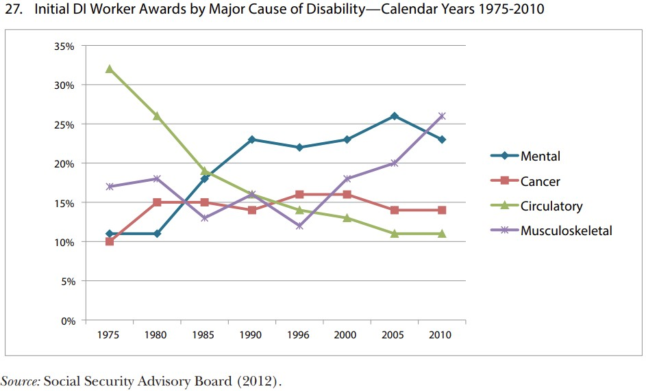
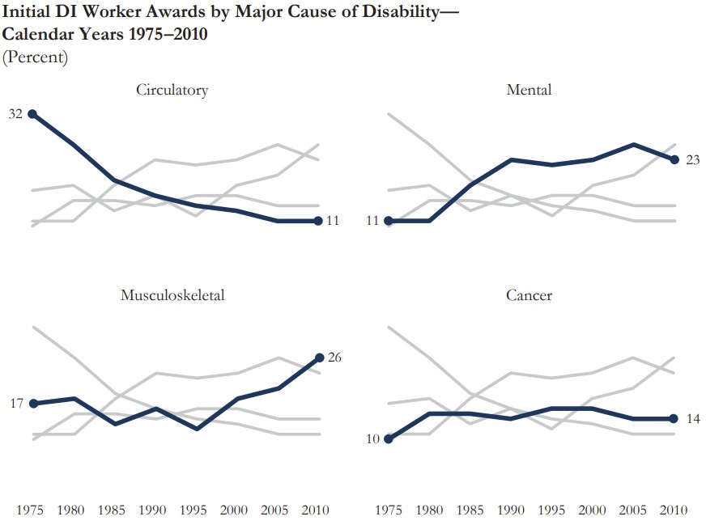

# Visualização {#sec-visualizacao}

## Introdução

Até aqui trabalhamos principalmente com tabelas, vetores e operações numéricas. Entretanto, grande parte da análise empírica em Economia depende da capacidade de explorar padrões visualmente. Gráficos permitem identificar tendências, distribuições, relações entre variáveis e possíveis problemas nos dados antes mesmo de qualquer modelagem estatística.

Em Python, a principal biblioteca para construção de gráficos é o `matplotlib`. Ela fornece controle detalhado sobre praticamente todos os elementos visuais de uma figura: eixos, títulos, legendas, cores, escalas e múltiplos gráficos. Neste capítulo aprenderemos a construir gráficos progressivamente, começando por gráficos simples de linha e avançando para figuras mais complexas com múltiplos painéis e diferentes tipos de visualização.

{#fig-olddesk width=800px max-width=100% fig-align="center"}
<!-- trocar a imagem por algum gráfico do Dunning-Kruger Effect em portuguÊs -->

Mais importante do que decorar comandos específicos é compreender a lógica geral de construção de gráficos a partir de perguntas como (i) quais dados serão representados, (ii) qual tipo de gráfico é adequado, (iii) como organizar visualmente a informação, (iv) como tornar a comunicação clara e interpretável. Ao final do capítulo, você será capaz de produzir gráficos adequados para análises exploratórias, trabalhos acadêmicos e projetos empíricos em Economia.

### Pré-requisitos

Para trabalhar com funções e todas as suas funcionalidades, utilizaremos quatro pacotes externos:

- `os`
- `numpy`
- `pandas`
- `matplotlib`

```{python}
#| message: false
#| warning: false

import os
import numpy as np
import pandas as pd
import matplotlib.pyplot as plt
```

## O que é o Matplotlib?

Matplotlib é uma excelente biblioteca de ferramentas gráficas, projetada para computação científica, que nos permite um grau bastante alto de personalização sobre todos os aspectos da apresentação. Nos permite construir visualizações estáticas em 2D e 3D e exportá-las nos mais diferentes formatos. Embora existam outras bibliotecas (e.g., [altair](https://altair-viz.github.io/), [bokeh](https://bokeh.org/), [plotly](https://plotly.com/python/)) que nos permitam construir visualizações dinâmicas e mais complexas, o Matplotlib é uma excelente primeira abordagem no campo de visualização de dados dentro do Python. Para a esmagadora maioria de nossas aplicações, é essa biblioteca que iremos buscar primeiro.

## Construindo nosso 1º gráfico

Em relação aos dados, utilizaremos mais uma vez os dados da [Penn World Table version 11.0](https://www.rug.nl/ggdc/productivity/pwt/?lang=en), base de dados com informação sobre níveis de renda, produto e produtividade de mais de 180 países durante o período de 1950 a 2023.

```{python}
# substituir esse caminho de diretório pelo caminho que você estiver utilizando no seu computador
os.chdir('C:/Users/user/Desktop/EAE1106')

columns_to_read = ['country','year','pop','emp','rgdpna','avh']
df_pwt = pd.read_csv('pwt110_selected.csv', sep=';', encoding='utf8',usecols=columns_to_read)
df_pwt.info()
```

Com o dataframe criado, podemos plotar o número médio de horas trabalhadas no Brasil ao longo do tempo usando apenas a função `plot`. Para isso utilizaremos a variável `avh`, que contabiliza o número de horas trabalhadas ao longo de um ano na média das pessoas empregadas. Para uma representação mais clara, dividirei esse número por 260, que é o número de dias de semana (segunda à sexta-feira) em um ano típico. Passamos então para a função plot como argumento os valores do eixo `x` (ano) e do eixo `y` (horas trabalhadas) e ela nos devolve um gráfico de linha relacionando esses dois conjuntos de dados. Após isso, é preciso chamar a função `show()` para mostrar o gráfico que criamos.


```{python}
df_pwtbr = df_pwt.loc[df_pwt['country']=='Brazil',:].reset_index(drop=True)

x = df_pwtbr['year']
y = df_pwtbr['avh'] / 260 

# construção do gráfico
plt.plot(x, y, 'b-', linewidth=2)
plt.show()
```

O gráfico tá feito, mas ficou um pouco feio. Como podemos melhorar?

- Ajustar o que mostramos no eixo X.
- Ajustar a escala do eixo Y.
- Mudar a cor da linha para algo mais agradável.
- Colocar um marcador em cada ponto de dado.
- Adicionar título ao gráfico.

Sabemos que nossos dados começam no ano de 1950 e vão até 2023. Para ajustar o eixo y, porém, é importante conhecer os limites numéricos do número médio de horas trabalhadas.

```{python}
df_pwtbr.describe()
```

Agora podemos usar algumas opções e métodos sobre o `plot` que criamos dentro da célula para aplicar todas essas alterações sugeridas.

```{python}
x_ticks = [1950,1960,1970,1980,1990,2000,2010,2020]
x_labels = ['1950','1960','1970','1980','1990','2000','2010','2020']
y_ticks = [5,6,7,8,9,10]
y_labels = ['5','6','7','8','9','10']

plt.plot(x, y, color='#1f77b4', linewidth=1, marker='o') # Saiba que o código "#1f77b4" é um código hexadecimal de cores. Para entender qual cor esse código representa acesse: https://htmlcolorcodes.com/

plt.xticks(x_ticks, x_labels)
plt.yticks(y_ticks, y_labels)
plt.ylim([4.8, 10.2])
plt.title('Horas médias trabalhadas por dia no Brasil')
plt.show()
```

O gráfico gerado até aqui já representa corretamente os dados, mas ainda possui aparência bastante simples. Em aplicações reais, normalmente precisamos ajustar elementos visuais para melhorar legibilidade e comunicação.

Uma das belezas do Python é sua lógica de programação multiparadigma, o que nos permite trabalhar também com a lógica orientada a objetos. Isso não é diferente com gráficos. Na estratégia que acabamos de utilizar, muitos dos objetos que compõe o gráfico como um todo (eixos, fundo, bordas, etc.) são criados e transmitidos sem se tornarem conhecidos pelo programador. Em geral é preferível um estilo de programação mais explícito, sob o qual teríamos mais controle sobre as várias dimensões do gráfico.

## Personalização

Vamos começar refazendo o primeiro gráfico, antes das alterações na escala e cores. Mas para isso deixaremos de lado a interface rápida do `matplotlib.pyplot` para uma interface mais orientada a objetos, que nos permite um maior controle sobre todos os elementos gráficos, como eixos e as próprias séries de dados. Ao longo do restante do curso priorizaremos a interface orientada a objetos, pois ela oferece maior controle e organização. 

Começamos utilizando a função `subplots()` do `matplotlib.pyplot`, que nos retorna dois objetos, os quais nomeamos como `fig` e `ax`:

```{python}
fig, ax = plt.subplots()

ax.plot(x, y, 'b-', linewidth=2)
plt.show()
```

O resultado é o mesmo, mas as propriedades dos objetos utilizados para a construção do gráfico são bem diferentes. Sem entrar nos detalhes de classes e instâncias da lógica de programação orientada a objetos no Python:

- `fig` é como se fosse um fundo branco.
- Pense em `ax` como sendo uma forma de iniciar um quadro sobre o qual construiremos a figura.

```{python}
fig, ax = plt.subplots()

fig.set_facecolor("red")
ax.set_facecolor("blue")

plt.show()
```

Em essência, a função `plot()` é na verdade um método do objeto `ax`. Embora fazer esse gráfico simples dessa forma exija um pouco mais de código, o uso explícito de objetos nos dá melhor controle sobre a aparência do objeto e de todas as personalizações possíveis. Isso ficará mais claro à medida que avançarmos. Como podemos replicar o 2º gráfico da seção anterior usando essa lógica orientada a objetos?

```{python}
x_ticks = [1950,1960,1970,1980,1990,2000,2010,2020]
x_labels = ['1950','1960','1970','1980','1990','2000','2010','2020']
y_ticks = [5,6,7,8,9,10]
y_labels = ['5','6','7','8','9','10']

fig, ax = plt.subplots()

ax.plot(x, y, color='#1f77b4', linewidth=1, marker='o')
ax.set_xticks(x_ticks)
ax.set_xticklabels(x_labels)
ax.set_yticks(y_ticks)
ax.set_yticklabels(y_labels)
ax.set_ylim(4.8, 10.2)

plt.title('Horas médias trabalhadas por dia no Brasil')
plt.show()
```

Foram várias linhas de código a mais com essa abordagem mais orientada a objeto, mas que no fim nos permite muito mais personalizações. Vamos tentar deixá-lo ainda melhor? A ideia por trás de uma figura é sempre a mesma: transmitir alguma informação de forma clara e direta. Seguindo essa ideia e partindo do gráfico inicial, vamos fazer mais algumas alterações uma a uma e ir comparando os resultados.

- Mudar a proporção do gráfico e manter a borda apenas do eixo X

```{python}
height = 6
fig, ax = plt.subplots(1,1, figsize=(1.50*height, height))

# Tipo de gráfico a ser plotado
ax.plot(x, y, color='#1f77b4', linewidth=1, marker='o', markersize=4)

# Visibilidade das bordas
ax.spines['top'].set_visible(False)
ax.spines['right'].set_visible(False)
ax.spines['left'].set_visible(False)
ax.spines['bottom'].set_visible(True)
ax.spines['bottom'].set_alpha(0.3)

# Mostrar o resultado
plt.show()
```

- Colocar linhas de grid para os valores de Y

```{python}
height = 6
fig, ax = plt.subplots(1,1, figsize=(1.50*height, height))

# Tipo de gráfico a ser plotado
ax.plot(x, y, color='#1f77b4', linewidth=1, marker='o', markersize=4)

# Visibilidade das bordas
ax.spines['top'].set_visible(False)
ax.spines['right'].set_visible(False)
ax.spines['left'].set_visible(False)
ax.spines['bottom'].set_visible(True)
ax.spines['bottom'].set_alpha(0.3)

# Linhas de grid
ax.grid(visible=True, which='major',axis='y', ls='-',lw=0.5,c='k',alpha=0.1) 

# Mostrar o resultado
plt.show()
```

- Mudar os marcadores do eixo x e do eixo y como já havíamos feito.

```{python}
height = 6
fig, ax = plt.subplots(1,1, figsize=(1.50*height, height))

# Tipo de gráfico a ser plotado
ax.plot(x, y, color='#1f77b4', linewidth=1, marker='o', markersize=4)

# Visibilidade das bordas
ax.spines['top'].set_visible(False)
ax.spines['right'].set_visible(False)
ax.spines['left'].set_visible(False)
ax.spines['bottom'].set_visible(True)
ax.spines['bottom'].set_alpha(0.3)

# Linhas de grid
ax.grid(visible=True, which='major',axis='y', ls='-',lw=0.5,c='k',alpha=0.1) 

# Marcadores dos eixos
ax.set_xticks(x_ticks)
ax.set_xticklabels(x_labels, fontsize=10, fontweight='light')
ax.set_yticks(y_ticks)
ax.set_yticklabels(y_labels, fontsize=10, fontweight='light')

# Limites dos eixos
ax.set_xlim(1949, 2024)
ax.set_ylim(4.8, 10.2)

# Mostrar o resultado
plt.show()
```

- Adicionar uma linha de referência que representa a média de horas trabalhadas ao longo do tempo.

```{python}
height = 6
fig, ax = plt.subplots(1,1, figsize=(1.50*height, height))

# Tipo de gráfico a ser plotado
ax.plot(x, y, color='#1f77b4', linewidth=1, marker='o', markersize=4)

# Visibilidade das bordas
ax.spines['top'].set_visible(False)
ax.spines['right'].set_visible(False)
ax.spines['left'].set_visible(False)
ax.spines['bottom'].set_visible(True)
ax.spines['bottom'].set_alpha(0.3)

# Linhas de grid
ax.grid(visible=True, which='major',axis='y', ls='-',lw=0.5,c='k',alpha=0.1) 

# Marcadores dos eixos
ax.set_xticks(x_ticks)
ax.set_xticklabels(x_labels, fontsize=10, fontweight='light')
ax.set_yticks(y_ticks)
ax.set_yticklabels(y_labels, fontsize=10, fontweight='light')

# Limites dos eixos
ax.set_xlim(1949, 2024)
ax.set_ylim(4.8, 10.2)

# Linha de referência
ax.plot([1949, 2024], [y.mean(), y.mean()], 'r--', lw=1.0)
ax.annotate('Média de horas trabalhadas\npor dia útil: {:,.2f}'.format(y.mean()),xy=(1949, 0.95*y.mean()),fontsize=9.5,color='r',fontweight='normal',style='italic')

# Mostrar o resultado
plt.show()
```

- Deixar o título maior e um pouco afastado do início da figura, juntamente com a fonte dos dados logo abaixo.
- Salvar a figura em formato .png

```{python}
height = 6
fig, ax = plt.subplots(1,1, figsize=(1.50*height, height))

# Tipo de gráfico a ser plotado
ax.plot(x, y, color='#1f77b4', linewidth=1, marker='o', markersize=4)

# Visibilidade das bordas
ax.spines['top'].set_visible(False)
ax.spines['right'].set_visible(False)
ax.spines['left'].set_visible(False)
ax.spines['bottom'].set_visible(True)
ax.spines['bottom'].set_alpha(0.3)

# Linhas de grid
ax.grid(visible=True, which='major',axis='y', ls='-',lw=0.5,c='k',alpha=0.1) 

# Marcadores dos eixos
ax.set_xticks(x_ticks)
ax.set_xticklabels(x_labels, fontsize=10, fontweight='light')
ax.set_yticks(y_ticks)
ax.set_yticklabels(y_labels, fontsize=10, fontweight='light')

# Limites dos eixos
ax.set_xlim(1949, 2024)
ax.set_ylim(4.8, 10.2)

# Linha de referência
ax.plot([1949, 2024], [y.mean(), y.mean()], 'r--', lw=1.0)
ax.annotate('Média de horas trabalhadas\npor dia útil: {:,.2f}'.format(y.mean()),xy=(1949, 0.95*y.mean()),fontsize=9.5,color='r',fontweight='normal',style='italic')

# Título e fonte
plt.suptitle('Horas médias trabalhadas por dia, Brasil',fontsize=15,fontweight='normal')
plt.title('Fonte: Penn World Table, Versão 11.0',fontsize=12,fontweight='normal',pad=15)

# Salvar a figura e mostrar o resultado
plt.savefig('avhbr_pwt11.png', bbox_inches='tight')
plt.show()
```

Uau, que diferença! Foram muitas linhas de código, mas esse é o preço de um bom gráfico e de uma boa visualização. O controle sobre todos os elementos que compõe uma figura é essencial para que possamos cumprir com o objetivo de tornar visualizações cada vez mais informativas e democráticas.

## Múltiplos gráficos

Até aqui trabalhamos com figuras contendo apenas um gráfico. Em aplicações empíricas, porém, é comum comparar diferentes séries ou combinar múltiplas visualizações em uma mesma figura. Para isso, precisamos organizar vários eixos dentro de um único objeto de figura.

Uma vez compreendida a lógica de construção de gráficos com a função `subplot()`, torna-se simples criar figuras com múltiplas séries em um mesmo gráfico ou distribuir diferentes gráficos lado a lado. Vamos começar pelo caso mais simples.

### Várias séries em um mesmo _plot_

Em posse dos dados de horas trabalhadas por país, uma pergunta que surge naturalmente é: como evoluiu ao longo do tempo e entre os diferentes países o número médio de horas trabalhadas por dia útil? Um aluno bem atento teria notado que no último gráfico da sessão anterior já havíamos juntado duas séries em um mesmo plot, sendo uma dessas séries a reta horizontal que representa a média de novos casos. Mas então basta adicionar mais uma linha de código com um segundo `ax.plot()`? É isso aí!

```{python}
x_ticks = [1950,1960,1970,1980,1990,2000,2010,2020]
x_labels = ['1950','1960','1970','1980','1990','2000','2010','2020']
y_ticks = [5,6,7,8,9,10]
y_labels = ['5','6','7','8','9','10']

x = df_pwt.loc[0:73,'year']
y1 = df_pwt.loc[df_pwt['country']=='Brazil','avh'] / 260 
y2 = df_pwt.loc[df_pwt['country']=='United States','avh'] / 260
```


```{python}
height = 6
fig, ax = plt.subplots(1,1, figsize=(1.50*height, height))

# Séries a serem plotadas
ax.plot(x, y1, color='#1f77b4',linewidth=2,marker='o',markersize=4)
ax.plot(x, y2, color='#d62728',linewidth=2,marker='s',markersize=4)

# Visibilidade das bordas
ax.spines['top'].set_visible(False)
ax.spines['right'].set_visible(False)
ax.spines['left'].set_visible(False)
ax.spines['bottom'].set_visible(True)
ax.spines['bottom'].set_alpha(0.3)

# Linhas de grid
ax.grid(visible=True, which='major',axis='y', ls='-',lw=0.5,c='k',alpha=0.1) 

# Marcadores dos eixos
ax.set_xticks(x_ticks)
ax.set_xticklabels(x_labels, fontsize=10, fontweight='light')
ax.set_yticks(y_ticks)
ax.set_yticklabels(y_labels, fontsize=10, fontweight='light')

# Limites dos eixos
ax.set_xlim(1949, 2024)
ax.set_ylim(4.8, 10.2)

# Título e fonte
plt.suptitle('Horas médias trabalhadas por dia, Brasil e Estados Unidos',fontsize=15,fontweight='normal')
plt.title('Fonte: Penn World Table, Versão 11.0',fontsize=12,fontweight='normal',pad=15)

# Salvar a figura e mostrar o resultado
plt.savefig('avh_countries_pwt11.png', bbox_inches='tight')
plt.show()
```

Super direto! Mas ainda falta a legenda. Para isso basta adicionar mais uma única linha de código.


```{python}
height = 6
fig, ax = plt.subplots(1,1, figsize=(1.50*height, height))

# Séries a serem plotadas
ax.plot(x, y1, color='#1f77b4',linewidth=2,marker='o',markersize=4,label='Brasil')
ax.plot(x, y2, color='#d62728',linewidth=2,marker='s',markersize=4,label='Estados Unidos')

# Legenda
ax.legend(loc='center',bbox_to_anchor=(0.2,0.2),framealpha=0,ncol=1,prop={'size': 12})

# Visibilidade das bordas
ax.spines['top'].set_visible(False)
ax.spines['right'].set_visible(False)
ax.spines['left'].set_visible(False)
ax.spines['bottom'].set_visible(True)
ax.spines['bottom'].set_alpha(0.3)

# Linhas de grid
ax.grid(visible=True, which='major',axis='y', ls='-',lw=0.5,c='k',alpha=0.1) 

# Marcadores dos eixos
ax.set_xticks(x_ticks)
ax.set_xticklabels(x_labels, fontsize=10, fontweight='light')
ax.set_yticks(y_ticks)
ax.set_yticklabels(y_labels, fontsize=10, fontweight='light')

# Limites dos eixos
ax.set_xlim(1949, 2024)
ax.set_ylim(4.8, 10.2)

# Título e fonte
plt.suptitle('Horas médias trabalhadas por dia',fontsize=15,fontweight='normal')
plt.title('Fonte: Penn World Table, Versão 11.0',fontsize=12,fontweight='normal',pad=15)

# Salvar a figura e mostrar o resultado
plt.savefig('avh_countries_pwt11.png', bbox_inches='tight')
plt.show()
```

Perfeito!

Vamos tentar agora vários plots dentro da mesma figura?

### Vários _plots_ dentro da mesma figura

Uma outra alternativa ao gráfico acima seria colocar cada série em um plot separado. Para tal, basta alterar os dois primeiros argumentos da função `subplots()`, que representam o número de linhas e o número de colunas da figura final. Nesse caso, porém, o objeto `ax` deixará de ser um simples objeto do matplotlib e se torna um `numpy.ndarray` com vários objetos do matplotlib. Aqui funciona a mesma lógica de indexação de sempre.

- Com uma linha e uma coluna na função subplots, ax é um objeto do matplotlib.

```{python}
num_rows = 1
num_cols = 1
height = 6
fig, ax = plt.subplots(num_rows,num_cols, figsize=(1.50*height, height))

type(ax)
```

- Com mais de linha e/ou coluna na função subplots, ax é um numpy array de objetos do matplotlib.

```{python}
num_rows = 2
num_cols = 1
height = 6
fig, ax = plt.subplots(num_rows,num_cols, figsize=(1.50*height, height))

type(ax)
```

Nesse mundo de múltiplos objetos gráficos, temos que usar algum tipo de loop justamente para poder lidar com as personalizações de cada plot de forma individual.

```{python}
num_rows = 2
num_cols = 1
height = 6
fig, ax = plt.subplots(num_rows,num_cols, figsize=(1.50*height, height))

# Séries a serem plotadas
ax[0].plot(x, y1, color='#1f77b4',linewidth=2,marker='o',markersize=4,label='Brasil')
ax[1].plot(x, y2, color='#d62728',linewidth=2,marker='s',markersize=4,label='Estados Unidos')

for i in range(0,2):
    # Legenda
    ax[i].legend(loc='upper left',bbox_to_anchor=(0.05,0.2),framealpha=0,ncol=1,prop={'size': 10})

    # Visibilidade das bordas
    ax[i].spines['top'].set_visible(False)
    ax[i].spines['right'].set_visible(False)
    ax[i].spines['left'].set_visible(False)
    ax[i].spines['bottom'].set_visible(True)
    ax[i].spines['bottom'].set_alpha(0.3)

    # Linhas de grid
    ax[i].grid(visible=True, which='major',axis='y', ls='-',lw=0.5,c='k',alpha=0.1) 

    # Marcadores dos eixos
    ax[i].set_xticks(x_ticks)
    ax[i].set_xticklabels(x_labels, fontsize=10, fontweight='light')
    ax[i].set_yticks(y_ticks)
    ax[i].set_yticklabels(y_labels, fontsize=10, fontweight='light')

    # Limites dos eixos
    ax[i].set_xlim(1949, 2024)
    ax[i].set_ylim(4.8, 10.2)

# Título e fonte
plt.suptitle('Horas médias trabalhadas por dia',fontsize=15,fontweight='normal')
plt.title('Fonte: Penn World Table, Versão 11.0',fontsize=12,fontweight='normal',pad=195)

# Salvar a figura e mostrar o resultado
plt.savefig('avh_countries2_pwt11.png', bbox_inches='tight')
plt.show()
```

Como sempre, **o céu é o limite!**

## Outros tipos de gráficos

O gráfico de linha não é a única visualização disponível no `matplotlib`, e muitas vezes nem é a mais adequada. Quando queremos comparar categorias, analisar distribuições ou investigar a relação entre variáveis, outros tipos de gráficos podem representar os dados de forma mais clara e informativa. A seguir veremos algumas das visualizações mais comuns utilizadas em análise de dados: gráficos de dispersão, barras e histogramas.

### Gráfico de dispersão: _scatter_

Gráficos de linha são particularmente úteis para representar a evolução de uma variável ao longo do tempo, mas menos adequados quando o objetivo é investigar a relação entre duas variáveis. Nesses casos, utilizamos o gráfico de dispersão (_scatterplot_, em inglês), que representa pares de valores ao longo de dois eixos.

Vamos construir um exemplo analisando a relação entre horas trabalhadas e PIB per capita em 2010. À primeira vista, poderíamos imaginar que países nos quais as pessoas trabalham mais horas tendem a apresentar maior PIB per capita, já que um volume maior de trabalho pode gerar mais produção. Por outro lado, países mais ricos e produtivos frequentemente possuem legislações trabalhistas que limitam a jornada de trabalho, justamente porque níveis elevados de produtividade permitem produzir mais mesmo com menos horas trabalhadas. Um gráfico de dispersão pode nos ajudar a visualizar qual dessas relações parece prevalecer nos dados. Atenção: como o PIB per capita costuma apresentar valores muito assimétricos entre países, pode ser mais informativo analisar o logaritmo do PIB per capita em vez dos valores absolutos.

```{python}
df_pwt['pibpc'] = df_pwt['rgdpna'] / df_pwt['pop']

x = df_pwt.loc[df_pwt['year']==2010,'avh'] / 260
y = df_pwt.loc[df_pwt['year']==2010,'pibpc']
y = np.log(y)

x_ticks = [5,7,9,11]
x_labels = ['5','7','9','11']
y_ticks = [5,7,9,11,13]
y_labels = ['5','7','9','11','13']
```


```{python}
height = 6
fig, ax = plt.subplots(1,1, figsize=(1.50*height, height))

# Séries a serem plotadas
ax.scatter(x,y,color='#1f77b4',marker='o',s=50)

# Visibilidade das bordas
ax.spines['top'].set_visible(False)
ax.spines['right'].set_visible(False)
ax.spines['left'].set_visible(False)
ax.spines['bottom'].set_visible(True)
ax.spines['bottom'].set_alpha(0.3)

# Linhas de grid
ax.grid(visible=True, which='major',axis='y', ls='-',lw=0.5,c='k',alpha=0.1) 

# Marcadores dos eixos
ax.set_xticks(x_ticks)
ax.set_xticklabels(x_labels, fontsize=10, fontweight='light')
ax.set_yticks(y_ticks)
ax.set_yticklabels(y_labels, fontsize=10, fontweight='light')

# Limites e título dos eixos
ax.set_xlim(4.8, 12)
ax.set_ylim(4.8, 13.2)
ax.set_xlabel('Número médio de horas trabalhadas por dia útil',fontsize=12, fontweight='light', labelpad=20)
ax.set_ylabel('Log do PIB per capita (US$)',fontsize=12, fontweight='light', labelpad=20)

# Título e fonte
plt.suptitle('Horas trabalhadas e PIB per capita, 2010',fontsize=15,fontweight='normal')
plt.title('Fonte: Penn World Table, Versão 11.0',fontsize=12,fontweight='normal',pad=15)

# Salvar a figura e mostrar o resultado
plt.savefig('avh_pibpc_scatter.png', bbox_inches='tight')
plt.show()
```

A simples visualização do gráfico de dispersão não nos permite tirar muitas conclusões, já que não parece haver nenhuma relação clara entre as variáveis, seja positiva, seja negativa. Que tal refazer a análise olhando por grupo de país (desenvolvido _vs_ em desenvolvimento) ou olhando para um único país ao longo do tempo?

### Gráfico de barra: _bar_ e _barh_

Um outro tipo de gráfico bastante interessante é o gráfico de barra, que serve muito ao propósito, por exemplo, de mostrar diferenças em uma variável de interesse, para um dado instante do tempo, entre regiões ou grupos diferentes. Dentre os 10 países com o maior PIB per capita em 2010, quais países tem ó maior número médio de horas trabalhadas? Aqui vamos usar o método `sort_values` e a coluna `pibpc` para ordenar os países de acordo com o PIB per capita. Atenção para o valor do parâmetro `ascending`, que ao ser definido como `False` estabelece que o ordenamento deve ser feito em ordem descendente.

```{python}
df_pwt_top10 = df_pwt[df_pwt['year']==2010].copy()
df_pwt_top10.sort_values(['pibpc'],ascending=False,ignore_index=True,inplace=True)

# Manter no dataframe apenas os países que possuem informações para todas as colunas
df_pwt_top10.dropna(inplace=True)

# Selecionar apenas os 10 países mais ricos
df_pwt_top10 = df_pwt_top10.iloc[0:10,:].reset_index(drop=True)
df_pwt_top10
```


```{python}
# Para não dar problema com os labels do eixo x serem muito grandes, vamos substituir aqueles que tem nomes compostos
df_pwt_top10.loc[5,'country'] = 'United\nArab\nEmirates'
df_pwt_top10.loc[9,'country'] = 'United\nStates'
```

À partir desses dados, podemos construir 2 tipos de gráfico de barras:

- Barra vertical

```{python}
x = df_pwt_top10['country']
y = df_pwt_top10['avh']

height = 8
fig, ax = plt.subplots(1,1, figsize=(1.50*height, height))

# Séries a serem plotadas
ax.bar(x,y,align='center',color='#1f77b4')

# Visibilidade das bordas
ax.spines['top'].set_visible(False)
ax.spines['right'].set_visible(False)
ax.spines['left'].set_visible(False)
ax.spines['bottom'].set_visible(True)
ax.spines['bottom'].set_alpha(0.3)

# Linhas de grid
ax.grid(visible=True, which='major',axis='y', ls='-',lw=0.5,c='k',alpha=0.1) 

# Título e fonte
plt.suptitle('Número médio de horas trabalhadas nos 10 países mais ricos, 2010',fontsize=15,fontweight='normal')
plt.title('Fonte: Penn World Table, Versão 11.0',fontsize=12,fontweight='normal',pad=25)

# Salvar a figura e mostrar o resultado
plt.savefig('avh_bar.png', bbox_inches='tight')
plt.show()
```

- Barra horizontal

```{python}
height = 8
fig, ax = plt.subplots(1,1, figsize=(1.50*height, height))

# Séries a serem plotadas
ax.barh(x,y,align='center',color='#1f77b4')

# Visibilidade das bordas
ax.spines['top'].set_visible(False)
ax.spines['right'].set_visible(False)
ax.spines['left'].set_visible(False)
ax.spines['bottom'].set_visible(True)
ax.spines['bottom'].set_alpha(0.3)

# Linhas de grid
ax.grid(visible=True, which='major',axis='y', ls='-',lw=0.5,c='k',alpha=0.1) 

# Título e fonte
plt.suptitle('Número médio de horas trabalhadas nos 10 países mais ricos, 2010',fontsize=15,fontweight='normal')
plt.title('Fonte: Penn World Table, Versão 11.0',fontsize=12,fontweight='normal',pad=25)

# Salvar a figura e mostrar o resultado
plt.savefig('avh_barh.png', bbox_inches='tight')
plt.show()
```

### Histograma: _hist_

O Matplotlib também nos oferece um conjunto bastante grande de gráficos estatísticos, como por exemplo o _boxplot_ e o _histograma_. Vamos utilizar esse último, através da função `hist`, para plotar em uma mesma figura histogramas de 4 variáveis diferentes para o ano de 2010: `pop`, `emp`, `avh` e `pibpc`.


```{python}
df_pwt2010 = df_pwt[df_pwt['year']==2010].copy()
df_pwt2010.dropna(inplace=True)
df_pwt2010['pibpc'] = np.log(df_pwt2010['pibpc'])
# Exclusão de China e Índia, países com mais de 1 bilhão de habitantes, para melhor visualização
df_pwt2010 = df_pwt2010.loc[df_pwt2010['pop']<1000,:]

num_rows = 2
num_cols = 2
height = 8
fig, ax = plt.subplots(num_rows,num_cols, figsize=(1.50*height, height))

# Séries a serem plotadas
ax[0,0].hist(df_pwt2010['pop'],color='#1f77b4',bins=40)
ax[0,1].hist(df_pwt2010['emp'],color='#1f77b4',bins=40)
ax[1,0].hist(df_pwt2010['avh'],color='#1f77b4',bins=40)
ax[1,1].hist(df_pwt2010['pibpc'],color='#1f77b4',bins=40)

ax[0,0].set_title('População (milhões)', fontsize=8, fontweight='light')
ax[0,1].set_title('Pessoas empregadas (milhões)', fontsize=8, fontweight='light')
ax[1,0].set_title('Horas trabalhadas por dia útil', fontsize=8, fontweight='light')
ax[1,1].set_title('Log do PIB per capita', fontsize=8, fontweight='light')

for r in range(0,2):
    for c in range(0,2):
        # Visibilidade das bordas
        ax[r,c].spines['top'].set_visible(False)
        ax[r,c].spines['right'].set_visible(False)
        ax[r,c].spines['left'].set_visible(False)
        ax[r,c].spines['bottom'].set_visible(True)
        ax[r,c].spines['bottom'].set_alpha(0.3)

        # Linhas de grid
        ax[r,c].grid(visible=True, which='major',axis='y', ls='-',lw=0.5,c='k',alpha=0.1) 

        
# Ajuste de espaço entre os vários plots
fig.subplots_adjust(hspace = 0.6, wspace = 0.3)

# Título e fonte
plt.suptitle('Características dos países em 2010',y=1.05,fontsize=15,fontweight='normal')
plt.text(2.7, 25.3,'Fonte: Penn World Table, Versão 11.0',fontsize=12,fontweight='normal')

# Salvar a figura e mostrar o resultado
plt.savefig('carac_countries_all.png', bbox_inches='tight')
plt.show()
```

## Visualização e _storytelling_

É parte importante do dia-a-dia de um economista - e também de grande parte do profissionais pertencentes ao grupo das ciências sociais aplicadas - ser capaz de comunicar os resultados de uma análise ou pesquisa. E como há muito tempo já se sabe, para comunicar e informar, **uma imagem vale mais do que mil palavras**.

No artigo [_An Economist's Guide to Visualizing Data_](https://pubs.aeaweb.org/doi/pdf/10.1257/jep.28.1.209), publicado no prestigiado _Journal of Economic Perspectives_ em 2014, o autor _Jonathan Schwabish_ fala sobre a importância de construir visualizações e gráficos que de fato chamem a atenção para aquilo que se deseja comunicar. Ele cita três princípios básicos na construção de uma boa visualização gráfica:

<br>

1. **Mostre os dados**. O conjunto de dados é o elemento básico por trás da história que se quer contar. Isso não quer dizer que é preciso mostrar todos os dados disponíveis, alguns gráficos mostram demais e acabam sendo pouco informativos. Mostre os dados, mas o faça da forma mais clara possível.


2. **Reduza a sujeira e a desordem gráfica**. O uso de elementos visuais desnecessários ou que distraem, tenderá a reduzir a eficácia do gráfico em comunicar uma mensagem. Pense duas vezes antes de utilizar bordas, linhas de referências muito grossas e escuras, pontos de referência desnecessários nos eixos, cores muito próximas em conjuntos de dados distintos, texturas, etc.


3. **Elementos visuais e textuais devem funcionar de forma integrada**. O gráfico não pode ser poluído de texto e se transformar naquilo que não é, mas elementos textuais podem ajudar bastante na tarefa de chamar a atenção para aquele que é o ponto principal da mensagem. O gráfico deve funcionar como um complemento ao texto, mas ao mesmo tempo deve se sustentar sem ele.
<br>

::: {#fig-visualization layout-ncol=2 width=700px max-width=100% fig-align="center"}





Exemplo de mudanças na estrutura do gráfico que aumentam seu conteúdo informacional. Fonte: _Schwabish (2014)_
:::

O artigo vai muito além desses 3 princípios básicos e mostra exemplos de visualizações ruins e de como é possível "consertá-las". Há, no entanto, outras várias fontes de informação sobre visualização (esse [link](https://datascience.quantecon.org/tools/visualization_rules.html) é uma ótima referência) e de como construir gráficos e visualizações a partir de uma ideia de _storytelling_, de utilizar dados e ferramentas gráficas para contar uma história e comunicar uma mensagem (o livro [Storytelling com dados](https://www.amazon.com.br/Storytelling-com-Dados-Visualiza%C3%A7%C3%A3o-Profissionais/dp/8550804681/ref=sr_1_1_sspa?keywords=storytelling+com+dados&qid=1668636806&qu=eyJxc2MiOiIxLjY5IiwicXNhIjoiMC45NiIsInFzcCI6IjAuNzYifQ%3D%3D&sprefix=story%2Caps%2C557&sr=8-1-spons&sp_csd=d2lkZ2V0TmFtZT1zcF9hdGY&psc=1) é outra ótima referência). Em resumo, construir um bom gráfico, uma visualização eficiente, é um trabalho de criatividade e de muita tentativa e erro. Uma determinada visualização pode funcionar muito bem para um certo tipo de dado e não funcionar para outros vários tipos. **Personalização** é a palavra chave nessa árdua tarefa de construir um bom gráfico.

<!-- ## Seaborn --> 

<!-- ## Plotly -->

## Conclusão

Neste capítulo introduzimos as principais ferramentas de visualização de dados em Python. Aprendemos a construir gráficos de linha, barras, dispersão e histogramas utilizando o `matplotlib`, além de organizar múltiplas visualizações em uma mesma figura e personalizar elementos gráficos. Mais importante do que memorizar comandos específicos é compreender que visualizações são instrumentos de análise e comunicação. Um gráfico adequado pode revelar padrões, inconsistências e relações que dificilmente seriam percebidos apenas observando tabelas de dados. As habilidades desenvolvidas neste capítulo serão utilizadas continuamente no restante do curso, especialmente em análises exploratórias, regressões e projetos empíricos aplicados à Economia.

## Exercícios

1. X

2. X